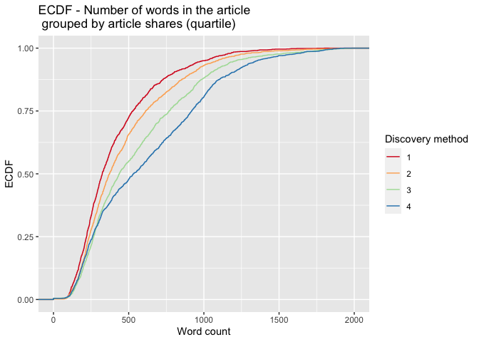

Analysis for the Business Channel
================
Maks Nikiforov and Mark Austin
Due 10/31/2021

-   [Introduction](#introduction)
-   [Summarizations](#summarizations)
    -   [Numerical Summaries](#numerical-summaries)
    -   [Contingency Tables](#contingency-tables)
    -   [Plots](#plots)
-   [Modeling](#modeling)
-   [Model Comparisons](#model-comparisons)
-   [References](#references)

``` r
# Read all data into a tibble
fullData<-read_csv("./data/OnlineNewsPopularity.csv")

# Eliminate non-predictive variables
reduceVarsData<-fullData %>% select(-url,-timedelta)
#Are there other vars we do not need to use??

#test code to be removed later
#params$channel<-"data_channel_is_bus"

#filter by the current params channel
channelData<-reduceVarsData %>% filter(eval(as.name(params$channel))==1) 

###Can now drop the data channel variables 
channelData<-channelData %>% select(-starts_with("data_channel"))
```

## Introduction

This page offers an exploratory data analysis of Business articles in
the [online news popularity data
set](https://archive.ics.uci.edu/ml/datasets/Online+News+Popularity).
The top ten articles in this category, based on the number of shares on
social media, include the following titles:

| Shares | Article title                                                   |
|-------:|:----------------------------------------------------------------|
| 843300 | Leaked: More Low-Cost iPhone Photos                             |
| 690400 | Dove Experiment Aims to Change the Way You See Yourself         |
| 663600 | ‘I’m Able to Make My Mark’: 10 Employees Describe Startup Life  |
| 652900 | Kanye West Lectures at Harvard About Creativity                 |
| 617900 | Viral Video Shows the Extent of U.S. Wealth Inequality          |
| 441000 | Roomba 880 Has More Sucking Power, Trouble With Obstacles       |
| 310800 | It’s Hot as Hell in Australia Right Now                         |
| 306100 | BlackBerry Sold 1 Million BlackBerry 10 Smartphones in Q4       |
| 298400 | IBM Brings Watson to the Masses and Other News You Need to Know |
| 284700 | U.S. Will Now Monitor All Travelers From Ebola Zone for 21 Days |

Two variables - `url` and `timedelta` - are non-predictive and have been
removed. The remaining 53 variables comprise 6258 observations, which
makes up 15.8 of the original data set. Fernandes et al., who sourced
the data, concentrated on article characteristics such as verbosity and
the polarity of content, publication day, the quantity of included
media, and keyword attributes (Fernandes et al., 2015). A subset of
these variables and the correlations between them are explored in
subsequent sections.

The broader purpose of this analysis is predicated on using supervised
learning to predict a target variable - `shares`. To this end, the final
sections outline four unique models for conducting such predictions and
an assessment of their relative performance. Two models are rooted in
multiple linear regression analysis, which assesses relationships
between a response variable and two or more predictors. The remaining
models are based on random forest and boosted tree techniques. The
random forest method averages results from multiple decision trees which
are fitted with a random parameter subset. The boosted tree method
spurns averages in favor of results that stem from weighted iterations
(James et al., 2021).

## Summarizations

### Numerical Summaries

Summary information for shares grouped by whether an article was a
weekend article or not. This gives an idea of the center and spread for
shares.

``` r
channelData %>% group_by(is_weekend) %>% 
  summarise(Avg = mean(shares), Sd = sd(shares), 
    Median = median(shares), IQR =IQR(shares)) %>% kable(caption = "Summary Statistics for Shares")
```

| is_weekend |      Avg |        Sd | Median |  IQR |
|-----------:|---------:|----------:|-------:|-----:|
|          0 | 2975.514 | 15614.231 |   1300 | 1376 |
|          1 | 3909.990 |  7563.786 |   2400 | 2400 |

Summary Statistics for Shares

The table below highlights variables with the highest and most
significant correlations in the data set. This output may be considered
when analyzing covariance to control for potentially confounding
variables.

``` r
# Display top 10 highest correlations
covarianceDF <- corr_cross(df = channelData, max_pvalue = 0.05, top = 10, plot = 0) %>% 
  select(key, mix, corr, pvalue) %>% rename("Variable 1" = key, "Variable 2" = mix, 
                                            "Correlation" = corr, "p-value" = pvalue) 

# Display non-zero p-values
covarianceDF[4] <- format.pval(covarianceDF[4])

kable(covarianceDF)
```

| Variable 1                 | Variable 2                 | Correlation | p-value     |
|:---------------------------|:---------------------------|------------:|:------------|
| kw_max_min                 | kw_avg_min                 |    0.976916 | \< 2.22e-16 |
| n_unique_tokens            | n_non_stop_unique_tokens   |    0.905731 | \< 2.22e-16 |
| rate_positive_words        | rate_negative_words        |   -0.903109 | \< 2.22e-16 |
| kw_max_avg                 | kw_avg_avg                 |    0.879080 | \< 2.22e-16 |
| self_reference_max_shares  | self_reference_avg_sharess |    0.866696 | \< 2.22e-16 |
| kw_min_min                 | kw_max_max                 |   -0.855276 | \< 2.22e-16 |
| self_reference_min_shares  | self_reference_avg_sharess |    0.810516 | \< 2.22e-16 |
| global_rate_negative_words | rate_negative_words        |    0.788070 | \< 2.22e-16 |
| weekday_is_sunday          | is_weekend                 |    0.749185 | \< 2.22e-16 |
| avg_negative_polarity      | min_negative_polarity      |    0.745006 | \< 2.22e-16 |

### Contingency Tables

``` r
##I want to try and split up shares then create a contingency table
```

### Plots

``` r
###this one is in progress, hopefully a scatter plot
g<-ggplot(data = channelData,
          aes(x= avg_negative_polarity,y=shares))
g + geom_point(aes(color=as.factor(is_weekend))) +
  scale_y_continuous(trans = "pseudo_log")
  
  scale_y_continuous(labels = scales::comma) 
```

``` r
###creating histogram of shares data 
g <- ggplot(channelData, aes( x = shares))
g + geom_histogram(binwidth=12000,color = "brown", fill = "green", 
  size = 1)  + labs(x="Article Shares", y="Pseudo Log of Count",
  title = "Histogram of Article Shares") +
  scale_y_continuous(trans = "pseudo_log",
                     breaks = c(0:3, 2000, 6000),minor_breaks = NULL) +
  scale_x_continuous(labels = scales::comma) 
```

<!-- -->

``` r
#depending on whether dr. post gives ok to do corrplot I'll do one of these for my 3rd graph
```

``` r
## Bar plot placeholder

# Subset columns to include only weekday_is_*
weekdayData <- channelData %>% select(starts_with("weekday_is"))

# Calculate sum of articles published in each week day
articlesPublished <- lapply(weekdayData, function(c) sum(c=="1"))

# Use factor to set specific order in bar plot
weekPubDF <- data.frame(weekday=c("Monday", "Tuesday", "Wednesday", 
                           "Thursday", "Friday", "Saturday", "Sunday"),
                count=articlesPublished)
weekPubDF$weekday = factor(weekPubDF$weekday, levels = c("Sunday", "Monday", "Tuesday", "Wednesday", 
                           "Thursday", "Friday", "Saturday"))

# Create bar plot with total publications by day
weekdayBar <- ggplot(weekPubDF, aes(x = weekday, y = articlesPublished)) + geom_bar(stat = "identity", color = "#123456", fill = "#0072B2") 
weekdayBar + labs(x = "Day", y = "Number published",
       title = "Article publications by day of week")
```

<!-- -->

``` r
# Subset columns to include only weekday_is_*, shares,
# create categorical variable, "day", denoting day of week (Mon-Sun)
medianShares <- channelData %>% select(starts_with("weekday_is"), shares) %>% mutate(day = NA)

# Populate "day"
for (i in 1:nrow(medianShares)) {
  if (medianShares$weekday_is_monday[i] == 1) {
    medianShares$day[i] = "Monday"
  }
  else if (medianShares$weekday_is_tuesday[i] == 1) {
    medianShares$day[i] = "Tuesday"
  }
  else if (medianShares$weekday_is_wednesday[i] == 1) {
    medianShares$day[i] = "Wednesday"
  }
  else if (medianShares$weekday_is_thursday[i] == 1) {
    medianShares$day[i] = "Thursday"
  }
  else if (medianShares$weekday_is_friday[i] == 1) {
    medianShares$day[i] = "Friday"
  }
  else if (medianShares$weekday_is_saturday[i] == 1) {
    medianShares$day[i] = "Saturday"
  }
  else if (medianShares$weekday_is_sunday[i] == 1) {
    medianShares$day[i] = "Sunday"
  }
  else {
    medianShares$day[i] = NA
  }
}

# Transform "day" into factor with levels to control order of boxplots
medianShares$day <- factor(medianShares$day, 
                           levels = c("Monday", "Tuesday", "Wednesday", 
                                      "Thursday", "Friday", "Saturday", "Sunday"))
```

``` r
# Plot distribution of shares for each day of the week
sharesBox <- ggplot(medianShares, aes(x = day, y = shares, fill = day))

sharesBox + geom_boxplot(outlier.shape = NA) + 
  # Exclude extreme outliers, limit range of y-axis
  coord_cartesian(ylim = quantile(medianShares$shares, c(0.1, 0.9))) +
  # Remove legend after coloration
  theme(legend.position = "none") +
  labs(x = "Day", y = "Shares",
       title = "Distribution of article shares for each publication day") + scale_fill_brewer(palette = "Spectral")
```

<!-- -->

``` r
# Create variable to for binning the shares
binnedShares <- channelData %>% mutate(shareQuantile = ntile(channelData$shares, 4))
binnedShares <- binnedShares %>% mutate(totalMedia = num_imgs + num_videos)

# Render and label word count ECDF, group by binned shares
avgWordHisto <- ggplot(binnedShares, aes(x = n_tokens_content, colour = shareQuantile))
avgWordHisto + stat_ecdf(geom = "step", aes(color = as.character(shareQuantile))) +
  labs(title="ECDF - Number of words in the article \n grouped by article shares (quartile)",
     y = "ECDF", x="Word count", color = "Shares (quartile)") + xlim(0,2000) + scale_colour_brewer(palette = "Spectral", name = "Shares (quartile)")
```

    ## Warning: Removed 83 rows containing
    ## non-finite values (stat_ecdf).

<!-- -->

## Modeling

``` r
#Using set.seed per suggestion so that work will be reproducible
set.seed(20)

dataIndex <-createDataPartition(channelData$shares, p = 0.7, list = FALSE)

channelTrain <-channelData[dataIndex,]
channelTest <-channelData[-dataIndex,]
```

``` r
# Seeing "Error in summary.connection(connection) : invalid connection" after
# previous parallel computing runs, stopCluster(cl) may not be working as expected
cl <- makePSOCKcluster(6)
registerDoParallel(cl)

# Linear regression 
lmFit1 <- train(shares ~ ., data = channelTrain,
               method = "lm",
               preProcess = c("center", "scale"),
               trControl = trainControl(method = "cv", 
                                        number = 5))


stopCluster(cl)

# Predict using test data
predictLM1 <- predict(lmFit1, newdata = channelTest)
```

    ## Warning in predict.lm(modelFit,
    ## newdata): prediction from a rank-
    ## deficient fit may be misleading

``` r
# Metrics
postResample(predictLM1, obs = channelTest$shares)
```

    ##         RMSE     Rsquared 
    ## 9.803982e+03 7.627239e-03 
    ##          MAE 
    ## 2.940958e+03

``` r
# Only RMSE
# RMSE(channelTest$shares, predictLM1)
```

``` r
##without parallel code this was still running after 30 minutes so tried parallel next

##my pc has 8 cores so chose 5

##Followed Parallel instructions on caret page
##   https://topepo.github.io/caret/parallel-processing.html
##Even then it took 10 minutest to run
## and picked m=1 so not sure this is working correctly yet?

cl <- makePSOCKcluster(5)
registerDoParallel(cl)

rfFit <- train(shares ~ ., data = channelData,
               method = "rf",
               trControl = trainControl(method = "cv",
                                number = 5),
               tuneGrid = data.frame(mtry = 1:15))

stopCluster(cl)

rfFit
```

``` r
# Seeing "Error in summary.connection(connection) : invalid connection"
# if I don't re-allocate cores for parallel computing
cl <- makePSOCKcluster(6)
registerDoParallel(cl)


# Boosted tree fit with tuneLength (let function decide parameter combinations)
boostedTreeFit <- train(shares ~ ., data = channelTrain,
               method = "gbm",
               preProcess = c("center", "scale"),
               trControl = trainControl(method = "cv", 
                                        number = 5),  
               tuneLength = 5)
```

    ## Iter   TrainDeviance   ValidDeviance   StepSize   Improve
    ##      1 283127995.2506             nan     0.1000 -29986.7550
    ##      2 282762962.5579             nan     0.1000 460698.4527
    ##      3 280139837.7493             nan     0.1000 42275.9737
    ##      4 278101304.4925             nan     0.1000 373760.4123
    ##      5 275870372.0039             nan     0.1000 -634382.2494
    ##      6 274019435.0526             nan     0.1000 -1413748.0931
    ##      7 274439542.2851             nan     0.1000 -1317774.0360
    ##      8 272660637.9990             nan     0.1000 -3458057.0467
    ##      9 271076646.6461             nan     0.1000 -251297.8084
    ##     10 271413432.8120             nan     0.1000 -1381182.0057
    ##     20 264566097.3466             nan     0.1000 -1396462.1271
    ##     40 257518729.8922             nan     0.1000 -149144.9056
    ##     50 254839199.3905             nan     0.1000 -506057.9791

``` r
# Define tuning parameters based on $bestTune from the permutations above
nTrees <- boostedTreeFit$bestTune$n.trees
interactionDepth = boostedTreeFit$bestTune$interaction.depth
minObs = boostedTreeFit$bestTune$n.minobsinnode
shrinkParam <- boostedTreeFit$bestTune$shrinkage

# Boosted tree fit with defined parameters
bestBoostedTree <- train(shares ~ ., data = channelTrain,
               method = "gbm",
               preProcess = c("center", "scale"),
               trControl = trainControl(method = "cv", 
                                        number = 5),  
               tuneGrid = expand.grid(n.trees = nTrees, interaction.depth = interactionDepth,
                                      shrinkage = shrinkParam, n.minobsinnode = minObs))
```

    ## Iter   TrainDeviance   ValidDeviance   StepSize   Improve
    ##      1 283016417.1714             nan     0.1000 -163876.7460
    ##      2 281853838.7849             nan     0.1000 1533975.0942
    ##      3 280454985.2650             nan     0.1000 -385874.7483
    ##      4 278360984.2313             nan     0.1000 -625644.5065
    ##      5 276242329.3125             nan     0.1000 435218.0949
    ##      6 275610447.0033             nan     0.1000 -1328858.3411
    ##      7 275839642.3471             nan     0.1000 -1021347.3344
    ##      8 273814390.5631             nan     0.1000 -371240.0398
    ##      9 272330283.9605             nan     0.1000 -700005.5254
    ##     10 271781790.3590             nan     0.1000 -892671.1537
    ##     20 264972934.6070             nan     0.1000 -1221929.6150
    ##     40 254768200.3025             nan     0.1000 -33913.4447
    ##     50 252250361.1288             nan     0.1000 -916140.8815

``` r
stopCluster(cl)

# summary(bestBoostedTree)

# Predict using test data
predictGBM <- predict(bestBoostedTree, newdata = channelTest)

# Metrics
postResample(predictGBM, obs = channelTest$shares)
```

    ##         RMSE     Rsquared 
    ## 1.015057e+04 3.028281e-03 
    ##          MAE 
    ## 2.725435e+03

``` r
# Only RMSE
# RMSE(channelTest$shares, predictGBM)
```

## Model Comparisons

This part needs to be automated. Maybe create a function and iterate
over these if they are similar?

## References

<div id="refs" class="references csl-bib-body hanging-indent"
line-spacing="2">

<div id="ref-10.1007/978-3-319-23485-4_53" class="csl-entry">

Fernandes, K., Vinagre, P., & Cortez, P. (2015). A proactive intelligent
decision support system for predicting the popularity of online news. In
F. Pereira, P. Machado, E. Costa, & A. Cardoso (Eds.), *Progress in
artificial intelligence* (pp. 535–546). Springer International
Publishing.

</div>

<div id="ref-2021" class="csl-entry">

James, G., Witten, D., Hastie, T., & Tibshirani, R. (2021). *An
introduction to statistical learning*. Springer US.
<https://doi.org/10.1007/978-1-0716-1418-1>

</div>

</div>
