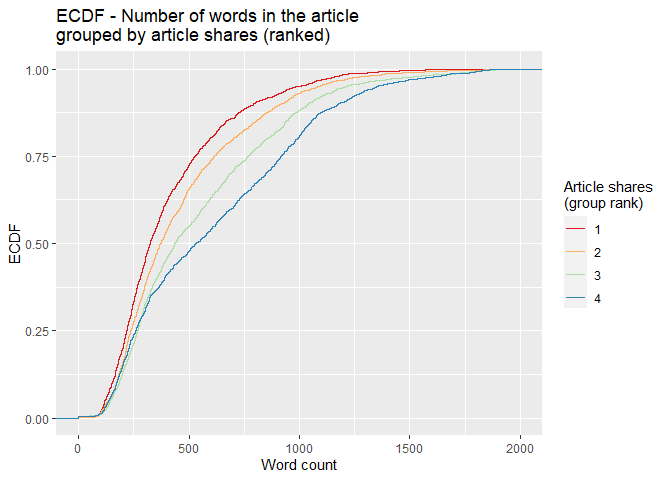

Analysis for the Business Channel
================
Maks Nikiforov and Mark Austin
Due 10/31/2021

-   [Data Import](#data-import)
-   [Introduction](#introduction)
-   [Summarizations](#summarizations)
    -   [Numerical Summaries](#numerical-summaries)
    -   [Contingency Table](#contingency-table)
    -   [Plots](#plots)
-   [Modeling](#modeling)
    -   [Splitting Data](#splitting-data)
    -   [Linear Regression Models](#linear-regression-models)
    -   [Random Forest Model](#random-forest-model)
    -   [Boosted Tree Model](#boosted-tree-model)
-   [Model Comparisons](#model-comparisons)
-   [References](#references)

## Data Import

Data was imported first to allow for a more automated introduction.

``` r
# Read all data into a tibble
fullData<-read_csv("./data/OnlineNewsPopularity.csv")

# Eliminate non-predictive variables
reduceVarsData<-fullData %>% select(-url,-timedelta)

#test code for pre markdown automation
#params$channel<-"data_channel_is_bus"

#filter by the current params channel
channelData<-reduceVarsData %>% filter(eval(as.name(params$channel))==1) 

# URL data for top ten articles in each category
channelDataURL <- fullData %>% filter(eval(as.name(params$channel))==1)

###Can now drop the data channel variables 
channelData<-channelData %>% select(-starts_with("data_channel"))
```

## Introduction

This page offers an exploratory data analysis of Business articles in
the [online news popularity data
set](https://archive.ics.uci.edu/ml/datasets/Online+News+Popularity).
The top ten articles in this category, based on the number of shares on
social media, include the following titles:

| Shares | Article title                                                   |
|-------:|:----------------------------------------------------------------|
| 690400 | Dove Experiment Aims to Change the Way You See Yourself         |
| 652900 | Kanye West Lectures at Harvard About Creativity                 |
| 310800 | It’s Hot as Hell in Australia Right Now                         |
| 306100 | BlackBerry Sold 1 Million BlackBerry 10 Smartphones in Q4       |
| 298400 | IBM Brings Watson to the Masses and Other News You Need to Know |
| 158900 | All The Christmas Movies You Need in One Mashup                 |
| 144400 | Can Beautiful Design Make Your Resume Stand Out?                |
| 139500 | Apple to Return $32.5 Million for Accidental App Purchases      |
| 110200 | How Big Data Is Influencing Hiring                              |
| 106400 | MapBox Enables Amazing Custom Maps for Sites and Apps           |

Two variables - `url` and `timedelta` - are non-predictive and have been
removed. The remaining 53 variables comprise 6258 observations, which
makes up 15.8 percent of the original data set. Fernandes et al., who
sourced the data, concentrated on article characteristics such as
verbosity and the polarity of content, publication day, the quantity of
included media, and keyword attributes (Fernandes et al., 2015). A
subset of these variables and the correlations between them are explored
in subsequent sections.

The broader purpose of this analysis is predicated on using supervised
learning to predict a target variable - `shares`. To this end, the final
sections outline four unique models for conducting such predictions and
an assessment of their relative performance. Two models are rooted in
multiple linear regression analysis, which assesses relationships
between a response variable and two or more predictors. The remaining
models are based on random forest and boosted tree techniques. The
random forest method averages results from multiple decision trees which
are fitted with a random parameter subset. The boosted tree method
spurns averages in favor of results that stem from weighted iterations
(James et al., 2021).

## Summarizations

### Numerical Summaries

The first table summarizes information for article shares grouped by
whether an article was a weekend article or not. This summary gives an
idea of the center and spread of `shares` across type of day group
levels.

``` r
channelData %>% 
  mutate(dayType=ifelse(is_weekend,"Weekend","Weekday")) %>%
  group_by(dayType) %>% 
  summarise(Avg = mean(shares), Sd = sd(shares), 
    Median = median(shares), IQR =IQR(shares)) %>% kable()
```

| dayType |      Avg |        Sd | Median |  IQR |
|:--------|---------:|----------:|-------:|-----:|
| Weekday | 2975.514 | 15614.231 |   1300 | 1376 |
| Weekend | 3909.990 |  7563.786 |   2400 | 2400 |

The next tables gives expands on the idea of the first table by grouping
`shares` by each day of the week. This summary gives an idea of the
center and spread of `shares` across day of the week group levels.

``` r
dowData<-channelData %>% select(starts_with("weekday_is"),shares) %>%
  mutate(dayofWeek=case_when(as.logical(weekday_is_monday)~"Monday",
                             as.logical(weekday_is_tuesday)~"Tuesday",
                             as.logical(weekday_is_wednesday)~"Wednesday",
                             as.logical(weekday_is_thursday)~"Thursday",
                             as.logical(weekday_is_friday)~"Friday",
                             as.logical(weekday_is_saturday)~"Saturday",
                             as.logical(weekday_is_sunday)~"Sunday")) %>%
  select(dayofWeek,shares)

dowLevels<-c("Monday","Tuesday","Wednesday",
             "Thursday","Friday","Saturday","Sunday")
dowData$dayofWeek<-factor(dowData$dayofWeek,levels = dowLevels)

dowData %>%  
  group_by(dayofWeek) %>% 
  summarise(Avg = mean(shares), Sd = sd(shares), 
    Median = median(shares), IQR =IQR(shares)) %>% kable()
```

| dayofWeek |      Avg |        Sd | Median |     IQR |
|:----------|---------:|----------:|-------:|--------:|
| Monday    | 3887.436 | 28313.186 |   1400 | 1651.00 |
| Tuesday   | 2932.336 | 10826.650 |   1300 | 1387.00 |
| Wednesday | 2676.552 |  8160.413 |   1300 | 1312.00 |
| Thursday  | 2885.192 | 13138.010 |   1300 | 1296.75 |
| Friday    | 2363.770 |  5133.923 |   1400 | 1420.25 |
| Saturday  | 4426.897 | 10139.138 |   2600 | 2150.00 |
| Sunday    | 3543.784 |  4979.289 |   2200 | 2400.00 |

The table below highlights variables with the highest and most
significant correlations in the data set. This output may be considered
when analyzing covariance to control for potentially confounding
variables.

``` r
# Display top 10 highest correlations
covarianceDF <- corr_cross(df = channelData, max_pvalue = 0.05, top = 10, plot = 0) %>% 
  select(key, mix, corr, pvalue) %>% rename("Variable 1" = key, "Variable 2" = mix, 
                                            "Correlation" = corr, "p-value" = pvalue) 

# Display non-zero p-values
covarianceDF[4] <- format.pval(covarianceDF[4])

kable(covarianceDF)
```

| Variable 1                    | Variable 2                    | Correlation | p-value       |
|:------------------------------|:------------------------------|------------:|:--------------|
| kw\_max\_min                  | kw\_avg\_min                  |    0.976916 | &lt; 2.22e-16 |
| n\_unique\_tokens             | n\_non\_stop\_unique\_tokens  |    0.905731 | &lt; 2.22e-16 |
| rate\_positive\_words         | rate\_negative\_words         |   -0.903109 | &lt; 2.22e-16 |
| kw\_max\_avg                  | kw\_avg\_avg                  |    0.879080 | &lt; 2.22e-16 |
| self\_reference\_max\_shares  | self\_reference\_avg\_sharess |    0.866696 | &lt; 2.22e-16 |
| kw\_min\_min                  | kw\_max\_max                  |   -0.855276 | &lt; 2.22e-16 |
| self\_reference\_min\_shares  | self\_reference\_avg\_sharess |    0.810516 | &lt; 2.22e-16 |
| global\_rate\_negative\_words | rate\_negative\_words         |    0.788070 | &lt; 2.22e-16 |
| weekday\_is\_sunday           | is\_weekend                   |    0.749185 | &lt; 2.22e-16 |
| avg\_negative\_polarity       | min\_negative\_polarity       |    0.745006 | &lt; 2.22e-16 |

### Contingency Table

The following contingency table displays counts and sums for the number
of article shares within given ranges by the day of week shared. Share
ranges were selected to illustrate lower, medium, and higher ranges of
shares. Examining these counts can show possible patterns of shares by
day or week and the range grouping for shares.

``` r
##dig.lab is needed to avoid R defaulting to scientific notation
kable(addmargins(table
                 (dowData$dayofWeek,cut(dowData$shares,
                  c(0,200,1000,10000,860000),dig.lab = 7))))
```

|           | (0,200\] | (200,1000\] | (1000,10000\] | (10000,860000\] |  Sum |
|:----------|---------:|------------:|--------------:|----------------:|-----:|
| Monday    |        2 |         369 |           739 |              43 | 1153 |
| Tuesday   |        2 |         422 |           714 |              44 | 1182 |
| Wednesday |        6 |         470 |           762 |              33 | 1271 |
| Thursday  |        3 |         439 |           762 |              30 | 1234 |
| Friday    |        5 |         232 |           582 |              13 |  832 |
| Saturday  |        1 |           9 |           220 |              13 |  243 |
| Sunday    |        0 |          26 |           300 |              17 |  343 |
| Sum       |       19 |        1967 |          4079 |             193 | 6258 |

### Plots

The following histogram looks at the distribution of `shares`. A pseudo
log y scale with modified y break values was used so that article
`shares` with low frequency will appear. We can tell from the histogram
whether `shares` has a symmetric or skewed distribution. The
distribution is symmetric if the tails are the same around the center.
The distribution is right skewed if there is a long left tail and right
skewed if there is a long right tail.

``` r
###creating histogram of shares data 
##scales comma was used to avoid the default scientific notation
##pseudo log with breaks was used to make low frequency values 
## more visisble
g <- ggplot(channelData, aes( x = shares))
g + geom_histogram(binwidth=12000,color = "brown", fill = "green", 
  size = 1)  + labs(x="Article Shares", y="Pseudo Log of Count",
  title = "Histogram of Article Shares") +
  scale_y_continuous(trans = "pseudo_log",
                     breaks = c(0:3, 2000, 6000),minor_breaks = NULL) +
  scale_x_continuous(labels = scales::comma) 
```

<!-- -->

Fernandes et al. highlight several variables in their random forest
model (Fernandes et al., 2015). The following variables from their top
11 were included in the following correlation plot with variables in ()
being renamed for this plot:
`shares`,`kw_min_avg`,`kw_max_avg`,`LDA_03`,`self_reference_min_shares`(`srmin_shares`),`kw_avg_max`,`self_reference_avg_sharess`(`sravg_shares`),`LDA_02`,`kw_avg_min`,`LDA_01`,`n_non_stop_unique_tokens`(`n_nstop_utokens`).  
The plot shows correlation with the response variable `shares` and the
other various combinations. Larger circles indicate stronger positive
(blue) or negative (red) correlation with correlation values on the
lower portion of the plot.

``` r
##Reduce variable name length for later plotting
## Otherwise var names overwrite Title no matter
##  how many other size tweaks were made
corrData<-channelData %>% 
  mutate(sravg_shares=self_reference_avg_sharess,
         srmin_shares=self_reference_min_shares,
         n_nstop_utokens=n_non_stop_unique_tokens)

Correlation<-cor(select(corrData, shares, kw_min_avg,
        kw_max_avg, LDA_03, srmin_shares,
        kw_avg_max, sravg_shares, LDA_02,
        kw_avg_min, LDA_01, n_nstop_utokens),
        method = "spearman")

corrplot(Correlation,type="upper",tl.pos="lt", tl.cex = .70)
corrplot(Correlation,type="lower",method="number",
         add=TRUE,diag=FALSE,tl.pos="n",tl.cex = .70,number.cex = .75,
         title = 
           "Correlation Plot of Shares and Variables of Interest",
         mar=c(0,0,.50,0),cex.main = .75)
```

<!-- -->

The following two scatterplots illustrate the relationship between
response article shares `shares` and predictor average keyword (max
shares) `kw_max_ave`. `kw_max_ave` was chosen because it was one of the
potential predictors examined in the previous correlation plot.

Both scatterplots plot these variables and add a simple linear
regression line to the graph.

For either graph, an upward relationship indicates higher average
keyword values tend towards more article shares. A negative relation
would indicate a lower average keyword values tend towards more article
shares.

In addition, both graphs use differing color for weekday and weekend
articles so that we can spot any possible trends with those values too.

The first scatterplot uses the default R generated axes so that
potential outliers or significant observations can be observed.

The second scatterplot reduces the scale of both axes to make it easier
to spot relationships for the majority of data that occur within these
bounds.

``` r
###Create new factor version of weekend variable 
### to use later in graphs
scatterData<-channelData %>% 
  mutate(dayType=ifelse(is_weekend,"Weekend","Weekday"))
scatterData$dayType<-as.factor(scatterData$dayType)

###First scatter plot with ALL data 
g<-ggplot(data = scatterData,
          aes(x= kw_max_avg,y=shares))
g + geom_point(aes(color=dayType)) +
  geom_smooth(method = lm) +
  scale_y_continuous(labels = scales::comma) +
  scale_x_continuous(labels = scales::comma) +
  labs(x="Avg. keyword (max. shares)", y="Article Shares",
       title = "Scatter Plot of Article Shares Versus Avg. keyword (max. shares)",color="") 
```

<!-- -->

``` r
###Second scatter plot with reduced axes
g<-ggplot(data = scatterData,
          aes(x= kw_max_avg,y=shares))
g + geom_point(aes(color=dayType)) +
  geom_smooth(method = lm) +
  ylim(0,10000) +
  xlim(0,20000) +
    labs(x="Avg. keyword (max. shares)", y="Article Shares",
       title = "Scatter Plot of Article Shares Versus Avg. keyword (max. shares)",
       color="")
```

<!-- -->

The bar plot below shows cumulative article publications for each day of
the week, with higher bars indicating more publications. However, days
with the largest number of publications are not necessarily ones with
the most article shares, as seen in the subsequent box plot.

``` r
# Subset columns to include only weekday_is_*
weekdayData <- channelData %>% select(starts_with("weekday_is"))

# Calculate sum of articles published in each week day
articlesPublished <- lapply(weekdayData, function(c) sum(c=="1"))

# Use factor to set specific order in bar plot
weekPubDF <- data.frame(weekday=c("Monday", "Tuesday", "Wednesday", 
                           "Thursday", "Friday", "Saturday", "Sunday"),
                count=articlesPublished)
weekPubDF$weekday = factor(weekPubDF$weekday, levels = c("Sunday", "Monday", "Tuesday", "Wednesday", 
                           "Thursday", "Friday", "Saturday"))

# Create bar plot with total publications by day
weekdayBar <- ggplot(weekPubDF, aes(x = weekday, y = articlesPublished)) + geom_bar(stat = "identity", color = "#123456", fill = "#0072B2") 
weekdayBar + labs(x = "Day", y = "Number published",
       title = "Article publications by day of week")
```

<!-- -->

The boxplot below examines the day of article publication
(Monday-Sunday) and the associated distribution of article `shares`. The
median line indicates the center of the distribution of `shares`, and
comparatively high medians indicate days that have relatively high
circulation of Mashable articles in social media networks. For days in
which the median is closer to the lower quartile (and where the upper
whisker may be taller than the lower whisker), the distribution is
skewed to the right. Conversely, a median that is closer to the upper
quartile indicates a distribution that is skewed to the left. Days with
relatively taller boxplots also have greater variability of `shares`.

``` r
# Subset columns to include only weekday_is_*, shares,
# create categorical variable, "day", denoting day of week (Mon-Sun)
medianShares <- channelData %>% select(starts_with("weekday_is"), shares) %>% mutate(day = NA)

# Populate "day"
for (i in 1:nrow(medianShares)) {
  if (medianShares$weekday_is_monday[i] == 1) {
    medianShares$day[i] = "Monday"
  }
  else if (medianShares$weekday_is_tuesday[i] == 1) {
    medianShares$day[i] = "Tuesday"
  }
  else if (medianShares$weekday_is_wednesday[i] == 1) {
    medianShares$day[i] = "Wednesday"
  }
  else if (medianShares$weekday_is_thursday[i] == 1) {
    medianShares$day[i] = "Thursday"
  }
  else if (medianShares$weekday_is_friday[i] == 1) {
    medianShares$day[i] = "Friday"
  }
  else if (medianShares$weekday_is_saturday[i] == 1) {
    medianShares$day[i] = "Saturday"
  }
  else if (medianShares$weekday_is_sunday[i] == 1) {
    medianShares$day[i] = "Sunday"
  }
  else {
    medianShares$day[i] = NA
  }
}

# Transform "day" into factor with levels to control order of boxplots
medianShares$day <- factor(medianShares$day, 
                           levels = c("Monday", "Tuesday", "Wednesday", 
                                      "Thursday", "Friday", "Saturday", "Sunday"))
```

``` r
# Plot distribution of shares for each day of the week
sharesBox <- ggplot(medianShares, aes(x = day, y = shares, fill = day))

sharesBox + geom_boxplot(outlier.shape = NA) + 
  # Exclude extreme outliers, limit range of y-axis
  coord_cartesian(ylim = quantile(medianShares$shares, c(0.1, 0.95))) +
  # Remove legend after coloration
  theme(legend.position = "none") +
  labs(x = "Day", y = "Shares",
       title = "Distribution of article shares for each publication day") + scale_fill_brewer(palette = "Spectral")
```

<!-- -->

For the empirical cumulative distribution function (ECDF) below, the
`dplyr` ranking function `ntile()` divides `shares` into four groups.
Observations with the fewest shares are placed into group 1, those with
the most shares are placed into group 4, and intermediaries reside in
groups 2 and 3. The horizontal axis lists word count, and the vertical
axis lists the percentage of content with that word count. A divergence
of the colored lines suggests that the number of words differs in
content with the fewest and most shares. At any given percentage of
content (y-value), curves further to the right correspond to more words
within the associated `shares` group. Groups with curves that are
further to the left indicate fewer words in that percentage of content.

``` r
# Create variable to for binning the shares
binnedShares <- channelData %>% mutate(shareQuantile = ntile(channelData$shares, 4))
binnedShares <- binnedShares %>% mutate(totalMedia = num_imgs + num_videos)

# Render and label word count ECDF, group by binned shares
avgWordHisto <- ggplot(binnedShares, aes(x = n_tokens_content, colour = shareQuantile))
avgWordHisto + stat_ecdf(geom = "step", aes(color = as.character(shareQuantile))) +
  labs(title="ECDF - Number of words in the article \ngrouped by article shares (ranked)",
     y = "ECDF", x="Word count") + xlim(0,2000) + 
  scale_colour_brewer(palette = "Spectral", name = "Article shares \n(group rank)")
```

<!-- -->

## Modeling

### Splitting Data

Per project requirements, the data for each channel are split with 70%
of the data becoming training data and 30% of the data becoming test
data.

``` r
#Using set.seed per suggestion so that work will be reproducible
set.seed(20)

dataIndex <-createDataPartition(channelData$shares, p = 0.7, list = FALSE)

channelTrain <-channelData[dataIndex,]
channelTest <-channelData[-dataIndex,]
```

### Linear Regression Models

Linear regression models describe a linear relationship between a
response variable and one or more explanatory variables. Models with one
explanatory variable are called simple linear regression models and
models with more than one explanatory variable are called multiple
linear regression models. Multiple linear regression models can include
polynomial and interaction terms. Each explanatory variable has an
associated estimated parameter. All linear regression models are linear
in the parameters.

For linear regression, explanatory variables can be continuous or
categorical. However, response variables are only continuous for linear
regression models.

Linear regression models are fit with training data by minimizing the
sum of squared errors. Model fitting results in a line for simple linear
regression and a saddle for multiple linear regression.

The first linear regression model contains predictors that encompass
content keywords, sentiment and subjectivity, the length of content (the
effects of which were gleaned previously from the ECDF), and link
citations.

``` r
# Parallel cluster setup
cl <- makePSOCKcluster(6)
registerDoParallel(cl)

# Linear regression with subset of predictors (p-value < 0.1) selected after performing 
# least squares fit on the entire set of predictors. 
lmFit1 <- train(shares ~ kw_avg_avg + kw_max_avg + kw_min_avg + 
    num_hrefs + self_reference_min_shares + global_subjectivity + 
    num_self_hrefs + n_tokens_title + n_tokens_content + n_unique_tokens + 
    average_token_length + kw_min_max + num_keywords + kw_max_min + abs_title_subjectivity + 
    global_rate_positive_words, 
    data = channelTrain,
               method = "lm",
               preProcess = c("center", "scale"),
               trControl = trainControl(method = "cv", 
                                        number = 5))
stopCluster(cl)
```

The second linear regression model contains main effects for all the
predictors listed earlier in the correlation plot.

``` r
cl <- makePSOCKcluster(6)
registerDoParallel(cl)

# Linear regression 
# Using same vars as in corrplot 
# See corrplot for why these were chosen
lmFit2 <- train(shares ~ kw_min_avg +
        kw_max_avg + LDA_03 + self_reference_min_shares +
        kw_avg_max + self_reference_avg_sharess + LDA_02 +
        kw_avg_min + LDA_01 + n_non_stop_unique_tokens, 
               data = channelTrain,
               method = "lm",
               preProcess = c("center", "scale"),
               trControl = trainControl(method = "cv", 
                                        number = 10))


stopCluster(cl)

lmFit2
```

### Random Forest Model

Random forest models aggregate results from many sample decision trees.
Those sample trees are produced using bootstrap samples created using
resampling with replacement. A tree is trained on each bootstrap sample,
resulting in a prediction based on that training sample data. Results
from all bootstrap samples are averaged to arrive at a final prediction.

Both bagging and random forest methods use bootstrap sampling with
decision trees. However, bagging includes all predictors which can lead
to less reduction in variance when strong predictors exist. Unlike
bagging, random forests do not use all predictors but use a random
subset of predictors for each bootstrap tree fit. Random forests usually
have a better fit than bagging models.

In this particular case, the response `shares` is continuous and we are
working with regression trees. The `mtry` tuning parameter controls how
many random predictors are used in the bootstrap samples. An `mtry` of 1
to 30 was chosen as a way to evaluate up to 30 predictors. These values
were chosen to work within available computing constraints. Five fold
cross validation is used to choose the optimal mtry value corresponding
to the lowest RMSE.

``` r
##Run time presented a challenge so parallel processing was used
##Followed Parallel instructions on caret page
##   https://topepo.github.io/caret/parallel-processing.html

##Various mtry values were tried with a 20 minute runtime goal
##  A 20 minute per channel runtime corresponds 
##  to a total of about 2 hours model fit for all 6 channels

##mtry 1:30 was chosen because it was close to 20 minutes
##mtry 1:20 had 10 minute runtime and 1:30 took 30 minutes

##repeatedcv was evaluated but took over 30 minutes 
## thus repeats were not used


cl <- makePSOCKcluster(6)
registerDoParallel(cl)

rfFit <- train(shares ~ ., data = channelTrain,
               method = "rf",
               preProcess = c("center", "scale"),
               trControl = trainControl(method = "cv",
                                number = 5),
               tuneGrid = data.frame(mtry = 1:30))

stopCluster(cl)

rfFit
```

    ## Random Forest 
    ## 
    ## 4382 samples
    ##   52 predictor
    ## 
    ## Pre-processing: centered (52), scaled (52) 
    ## Resampling: Cross-Validated (5 fold) 
    ## Summary of sample sizes: 3506, 3506, 3504, 3506, 3506 
    ## Resampling results across tuning parameters:
    ## 
    ##   mtry  RMSE      Rsquared    MAE     
    ##    1    14890.12  0.03145458  2837.164
    ##    2    15040.96  0.02933558  2903.931
    ##    3    15171.47  0.02567270  2933.521
    ##    4    15335.50  0.02332574  2974.780
    ##    5    15532.18  0.02025297  2991.222
    ##    6    15653.58  0.01839011  3023.554
    ##    7    15677.90  0.01855645  3031.803
    ##    8    15996.41  0.01622697  3070.579
    ##    9    15975.03  0.01698446  3080.933
    ##   10    16042.27  0.01771635  3090.988
    ##   11    16173.43  0.01588203  3085.666
    ##   12    16148.39  0.01551689  3100.412
    ##   13    16119.63  0.01625215  3088.022
    ##   14    16363.03  0.01455047  3130.017
    ##   15    16181.99  0.01489809  3120.928
    ##   16    16251.89  0.01388384  3128.875
    ##   17    16373.60  0.01431683  3141.608
    ##   18    16494.23  0.01238045  3154.666
    ##   19    16413.15  0.01293169  3152.633
    ##   20    16597.18  0.01249404  3169.338
    ##   21    16680.73  0.01222214  3170.733
    ##   22    16402.72  0.01151833  3152.689
    ##   23    16578.82  0.01358022  3156.448
    ##   24    16466.51  0.01191402  3168.896
    ##   25    16567.99  0.01181646  3185.864
    ##   26    16524.27  0.01221460  3163.637
    ##   27    16738.15  0.01163398  3193.647
    ##   28    16837.01  0.01245574  3195.433
    ##   29    16803.55  0.01211917  3195.775
    ##   30    16938.78  0.01136888  3210.828
    ## 
    ## RMSE was used to select the optimal model using the smallest value.
    ## The final value used for the model was mtry = 1.

After fitting the random forest model, the following variable importance
plot is created. The top ten most important predictors are plotted using
a scale of 0 to 100.

``` r
rfImp <- varImp(rfFit, scale = TRUE)
plot(rfImp,top = 10, main="Random Forest Model\nTop 10 Importance Plot")
```

<!-- -->

### Boosted Tree Model

Boosting is a general method whereby decision trees are grown
sequentially using residuals (the differences between observed values
and predicted values of a variable) as the response. Initial prediction
values start at 0 for all combinations of predictors, so that the first
set of residuals matches the observed values in our data. To mitigate
low bias and high variance, contributions from subsequent trees are
scaled with a shrinkage parameter, *λ*. The value of this parameter is
generally small (0.01 or 0.001), which slows tree growth and tampers
overfitting (James et al., 2021).

``` r
# Re-allocate cores for parallel computing
cl <- makePSOCKcluster(6)
registerDoParallel(cl)


# Boosted tree fit with tuneLength (let function decide parameter combinations)
boostedTreeFit <- train(shares ~ ., data = channelTrain,
               method = "gbm",
               preProcess = c("center", "scale"),
               trControl = trainControl(method = "cv", 
                                        number = 5),  
               tuneLength = 5)
```

    ## Iter   TrainDeviance   ValidDeviance   StepSize   Improve
    ##      1 283409072.2697             nan     0.1000 -83960.4166
    ##      2 280978872.6293             nan     0.1000 -146705.1979
    ##      3 279012218.5718             nan     0.1000 -338754.5361
    ##      4 277061267.4391             nan     0.1000 -469478.7030
    ##      5 276859225.2438             nan     0.1000 -118503.0608
    ##      6 275488071.0598             nan     0.1000 -282600.4104
    ##      7 274290200.1770             nan     0.1000 -650634.8451
    ##      8 274077262.0476             nan     0.1000 67149.3659
    ##      9 273787020.2861             nan     0.1000 382104.7027
    ##     10 273037220.0058             nan     0.1000 -664751.2152
    ##     20 264986383.8918             nan     0.1000 -341841.7639
    ##     40 256506148.7169             nan     0.1000 -1703672.3617
    ##     50 254139580.5369             nan     0.1000 -1073899.6042

``` r
# Define tuning parameters based on $bestTune from the permutations above
nTrees <- boostedTreeFit$bestTune$n.trees
interactionDepth = boostedTreeFit$bestTune$interaction.depth
minObs = boostedTreeFit$bestTune$n.minobsinnode
shrinkParam <- boostedTreeFit$bestTune$shrinkage

# Boosted tree fit with defined parameters
bestBoostedTree <- train(shares ~ ., data = channelTrain,
               method = "gbm",
               preProcess = c("center", "scale"),
               trControl = trainControl(method = "cv", 
                                        number = 5),  
               tuneGrid = expand.grid(n.trees = nTrees, interaction.depth = interactionDepth,
                                      shrinkage = shrinkParam, n.minobsinnode = minObs))
```

    ## Iter   TrainDeviance   ValidDeviance   StepSize   Improve
    ##      1 282087483.6694             nan     0.1000 -290705.5199
    ##      2 280380382.6921             nan     0.1000 -519595.0378
    ##      3 279343194.4944             nan     0.1000 -376257.1922
    ##      4 278639210.0420             nan     0.1000 -1257722.7860
    ##      5 278222946.4359             nan     0.1000 -1191411.8982
    ##      6 276735736.6750             nan     0.1000 997418.0997
    ##      7 275206863.3175             nan     0.1000 922257.3742
    ##      8 272916782.4655             nan     0.1000 -459522.7614
    ##      9 272999070.4616             nan     0.1000 -847294.8887
    ##     10 270856713.5097             nan     0.1000 -357775.4802
    ##     20 263415447.8759             nan     0.1000 -1069225.0043
    ##     40 254738882.2609             nan     0.1000 -810467.6399
    ##     50 251233557.7684             nan     0.1000 -836015.9677

``` r
stopCluster(cl)
```

## Model Comparisons

After models were fit with training data, we do predictions with testing
data. Finally, RMSE metrics are extracted and compared. The model with
lowest RMSE is presented as the winning model.

``` r
# Predict using test data
predictLM1 <- predict(lmFit1, newdata = channelTest)

# Metrics
RMSELM1 <- postResample(predictLM1, obs = channelTest$shares)["RMSE"][[1]]
RMSELM1
```

    ## [1] 9683.193

``` r
# Store value for model comparison
modelPerformance <- tibble(RMSE = RMSELM1, Model = "Linear regression 1")
```

``` r
predictLM2 <- predict(lmFit2, newdata = channelTest)
RMSELM2<-postResample(predictLM2, channelTest$shares)["RMSE"][[1]]
RMSELM2
```

    ## [1] 9838.997

``` r
modelPerformance <- add_row(modelPerformance, RMSE = RMSELM2, Model = "Linear regression 2")
```

``` r
predictRF <- predict(rfFit, newdata = channelTest)
RMSERF<-postResample(predictRF, channelTest$shares)["RMSE"]
RMSERF
```

    ##     RMSE 
    ## 9442.735

``` r
modelPerformance <- add_row(modelPerformance, RMSE = RMSERF, Model = "Random forest")
```

``` r
# Predict using test data
predictGBM <- predict(bestBoostedTree, newdata = channelTest)

# Metrics
RMSEGBM <- postResample(predictGBM, obs = channelTest$shares)["RMSE"]
RMSEGBM
```

    ##     RMSE 
    ## 10295.24

``` r
modelPerformance <- add_row(modelPerformance, RMSE = RMSEGBM, Model = "Boosted tree")
```

``` r
# Select row with lowest value of RMSE.
selectModel <- modelPerformance %>% slice_min(RMSE)
selectModel
```

    ## # A tibble: 1 x 2
    ##    RMSE Model        
    ##   <dbl> <chr>        
    ## 1 9443. Random forest

Based on the preceding analyses with test data, the Random forest model
yields the lowest RMSE - 9442.7346433.

## References

<div id="refs" class="references csl-bib-body hanging-indent"
line-spacing="2">

<div id="ref-10.1007/978-3-319-23485-4_53" class="csl-entry">

Fernandes, K., Vinagre, P., & Cortez, P. (2015). A proactive intelligent
decision support system for predicting the popularity of online news. In
F. Pereira, P. Machado, E. Costa, & A. Cardoso (Eds.), *Progress in
artificial intelligence* (pp. 535–546). Springer International
Publishing.

</div>

<div id="ref-2021" class="csl-entry">

James, G., Witten, D., Hastie, T., & Tibshirani, R. (2021). *An
introduction to statistical learning*. Springer US.
<https://doi.org/10.1007/978-1-0716-1418-1>

</div>

</div>
