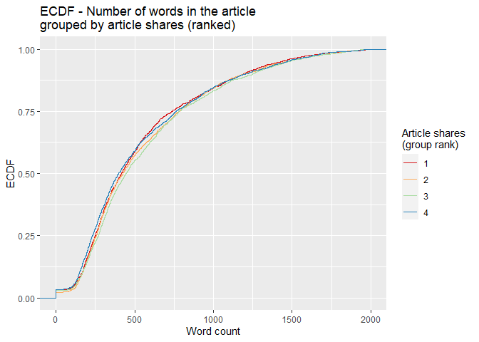

Analysis for the Entertainment Channel
================
Maks Nikiforov and Mark Austin
Due 10/31/2021

-   [Introduction](#introduction)
-   [Summarizations](#summarizations)
    -   [Numerical Summaries](#numerical-summaries)
    -   [Contingency Tables](#contingency-tables)
    -   [Plots](#plots)
-   [Modeling](#modeling)
    -   [Splitting Data](#splitting-data)
    -   [Linear Regression Models](#linear-regression-models)
    -   [Random Forest Model](#random-forest-model)
    -   [Boosted Tree Model](#boosted-tree-model)
-   [Model Comparisons](#model-comparisons)
-   [References](#references)

``` r
# Read all data into a tibble
fullData<-read_csv("./data/OnlineNewsPopularity.csv")

# Eliminate non-predictive variables
reduceVarsData<-fullData %>% select(-url,-timedelta)
#Are there other vars we do not need to use??

#test code to be removed later
#params$channel<-"data_channel_is_bus"

#filter by the current params channel
channelData<-reduceVarsData %>% filter(eval(as.name(params$channel))==1) 

# Temp, will clean up
channelDataURL <- fullData %>% filter(eval(as.name(params$channel))==1)

###Can now drop the data channel variables 
channelData<-channelData %>% select(-starts_with("data_channel"))

# Temp, will clean up
channelDataURL <- fullData %>% filter(eval(as.name(params$channel))==1)
```

## Introduction

This page offers an exploratory data analysis of Entertainment articles
in the [online news popularity data
set](https://archive.ics.uci.edu/ml/datasets/Online+News+Popularity).
The top ten articles in this category, based on the number of shares on
social media, include the following titles:

| Shares | Article title                                                         |
|-------:|:----------------------------------------------------------------------|
| 210300 | Sprint’s New Plans Guarantee Unlimited Data for Life                  |
| 197600 | What to Do With Your New Xbox One                                     |
| 193400 | McDonalds Kills Site That Advised Employees to Eat Healthy Meals      |
| 138700 | How a $6,000 Video Got 6 Million Views and Launched a Business        |
| 112600 | ‘Flappy Bird Typing Tutor’ Is Even More Frustrating Than the Original |
| 109500 | Russian Hackers Used Microsoft Bug to Spy on Ukraine and NATO         |
| 109100 | An App That Fights Back Against Smartphone Thieves                    |
|  98500 | Australian Patient Tests Negative for Ebola                           |
|  98000 | Facebook Makes Inroads in Russia With Yandex Partnership              |
|  96000 | Samsung Trial Jury to Apple: Go After Google                          |

Two variables - `url` and `timedelta` - are non-predictive and have been
removed. The remaining 53 variables comprise 7057 observations, which
makes up 17.8 percent of the original data set. Fernandes et al., who
sourced the data, concentrated on article characteristics such as
verbosity and the polarity of content, publication day, the quantity of
included media, and keyword attributes (Fernandes et al., 2015). A
subset of these variables and the correlations between them are explored
in subsequent sections.

The broader purpose of this analysis is predicated on using supervised
learning to predict a target variable - `shares`. To this end, the final
sections outline four unique models for conducting such predictions and
an assessment of their relative performance. Two models are rooted in
multiple linear regression analysis, which assesses relationships
between a response variable and two or more predictors. The remaining
models are based on random forest and boosted tree techniques. The
random forest method averages results from multiple decision trees which
are fitted with a random parameter subset. The boosted tree method
spurns averages in favor of results that stem from weighted iterations
(James et al., 2021).

## Summarizations

### Numerical Summaries

The first table summarizes information for article shares grouped by
whether an article was a weekend article or not. This summary gives an
idea of the center and spread of `shares` across type of day group
levels.

``` r
channelData %>% 
  mutate(dayType=ifelse(is_weekend,"Weekend","Weekday")) %>%
  group_by(dayType) %>% 
  summarise(Avg = mean(shares), Sd = sd(shares), 
    Median = median(shares), IQR =IQR(shares)) %>% kable()
```

| dayType |      Avg |       Sd | Median |  IQR |
|:--------|---------:|---------:|-------:|-----:|
| Weekday | 2869.537 | 8059.543 |   1100 | 1102 |
| Weekend | 3647.273 | 6306.950 |   1650 | 2200 |

The next tables gives expands on the idea of the first table by grouping
`shares` by each day of the week. This summary gives an idea of the
center and spread of `shares` across day of the week group levels.

``` r
dowData<-channelData %>% select(starts_with("weekday_is"),shares) %>%
  mutate(dayofWeek=case_when(as.logical(weekday_is_monday)~"Monday",
                             as.logical(weekday_is_tuesday)~"Tuesday",
                             as.logical(weekday_is_wednesday)~"Wednesday",
                             as.logical(weekday_is_thursday)~"Thursday",
                             as.logical(weekday_is_friday)~"Friday",
                             as.logical(weekday_is_saturday)~"Saturday",
                             as.logical(weekday_is_sunday)~"Sunday")) %>%
  select(dayofWeek,shares)

dowLevels<-c("Monday","Tuesday","Wednesday",
             "Thursday","Friday","Saturday","Sunday")
dowData$dayofWeek<-factor(dowData$dayofWeek,levels = dowLevels)

dowData %>%  
  group_by(dayofWeek) %>% 
  summarise(Avg = mean(shares), Sd = sd(shares), 
    Median = median(shares), IQR =IQR(shares)) %>% kable()
```

| dayofWeek |      Avg |       Sd | Median |    IQR |
|:----------|---------:|---------:|-------:|-------:|
| Monday    | 2931.036 | 7176.296 |   1100 | 1102.0 |
| Tuesday   | 2708.033 | 6453.317 |   1100 | 1115.0 |
| Wednesday | 2854.619 | 8285.402 |   1100 | 1131.5 |
| Thursday  | 2882.213 | 9315.865 |   1100 | 1196.0 |
| Friday    | 3000.947 | 9067.884 |   1200 | 1150.0 |
| Saturday  | 3416.400 | 6459.886 |   1600 | 1400.0 |
| Sunday    | 3810.951 | 6197.104 |   1700 | 2600.0 |

The table below highlights variables with the highest and most
significant correlations in the data set. This output may be considered
when analyzing covariance to control for potentially confounding
variables.

``` r
# Display top 10 highest correlations
covarianceDF <- corr_cross(df = channelData, max_pvalue = 0.05, top = 10, plot = 0) %>% 
  select(key, mix, corr, pvalue) %>% rename("Variable 1" = key, "Variable 2" = mix, 
                                            "Correlation" = corr, "p-value" = pvalue) 

# Display non-zero p-values
covarianceDF[4] <- format.pval(covarianceDF[4])

kable(covarianceDF)
```

| Variable 1                    | Variable 2                    | Correlation | p-value       |
|:------------------------------|:------------------------------|------------:|:--------------|
| n\_unique\_tokens             | n\_non\_stop\_unique\_tokens  |    0.999973 | &lt; 2.22e-16 |
| n\_unique\_tokens             | n\_non\_stop\_words           |    0.999920 | &lt; 2.22e-16 |
| n\_non\_stop\_words           | n\_non\_stop\_unique\_tokens  |    0.999902 | &lt; 2.22e-16 |
| kw\_max\_min                  | kw\_avg\_min                  |    0.962390 | &lt; 2.22e-16 |
| kw\_min\_min                  | kw\_max\_max                  |   -0.867860 | &lt; 2.22e-16 |
| LDA\_01                       | LDA\_03                       |   -0.860914 | &lt; 2.22e-16 |
| self\_reference\_max\_shares  | self\_reference\_avg\_sharess |    0.830012 | &lt; 2.22e-16 |
| kw\_max\_avg                  | kw\_avg\_avg                  |    0.821630 | &lt; 2.22e-16 |
| global\_rate\_negative\_words | rate\_negative\_words         |    0.790036 | &lt; 2.22e-16 |
| weekday\_is\_sunday           | is\_weekend                   |    0.742330 | &lt; 2.22e-16 |

### Contingency Tables

The following contingency table displays counts and sums for the number
of article shares within given ranges by the day of week shared. Share
ranges were selected to illustrate lower, medium, and higher ranges of
shares. Examining these counts can show possible patterns of shares by
day or week and the range grouping for shares.

``` r
##dig.lab is needed to avoid R defaulting to scientific notation
kable(addmargins(table
                 (dowData$dayofWeek,cut(dowData$shares,
                  c(0,200,1000,10000,860000),dig.lab = 7))))
```

|           | (0,200\] | (200,1000\] | (1000,10000\] | (10000,860000\] |  Sum |
|:----------|---------:|------------:|--------------:|----------------:|-----:|
| Monday    |        6 |         619 |           655 |              78 | 1358 |
| Tuesday   |        5 |         595 |           623 |              62 | 1285 |
| Wednesday |        5 |         627 |           596 |              67 | 1295 |
| Thursday  |        4 |         570 |           594 |              63 | 1231 |
| Friday    |        4 |         395 |           519 |              54 |  972 |
| Saturday  |        2 |          65 |           287 |              26 |  380 |
| Sunday    |        1 |          91 |           405 |              39 |  536 |
| Sum       |       27 |        2962 |          3679 |             389 | 7057 |

### Plots

The following histogram looks at the distribution of `shares`. A pseudo
log y scale with modified y break values was used so that article
`shares` with low frequency will appear. We can tell from the histogram
whether `shares` has a symmetric or skewed distribution. The
distribution is symmetric if the tails are the same around the center.
The distribution is right skewed if there is a long left tail and right
skewed if there is a long right tail.

``` r
###creating histogram of shares data 
##scales comma was used to avoid the default scientific notation
##pseudo log with breaks was used to make low frequency values 
## more visisble
g <- ggplot(channelData, aes( x = shares))
g + geom_histogram(binwidth=12000,color = "brown", fill = "green", 
  size = 1)  + labs(x="Article Shares", y="Pseudo Log of Count",
  title = "Histogram of Article Shares") +
  scale_y_continuous(trans = "pseudo_log",
                     breaks = c(0:3, 2000, 6000),minor_breaks = NULL) +
  scale_x_continuous(labels = scales::comma) 
```

<!-- -->

Fernandes et al highlight several variables in their random forest model
(Fernandes et al., 2015). The following variables from their top 11 were
included in the following correlation plot with variables in () being
renamed for this plot:
`shares`,`kw_min_avg`,`kw_max_avg`,`LDA_03`,`self_reference_min_shares`(`srmin_shares`),`kw_avg_max`,`self_reference_avg_sharess`(`sravg_shares`),`LDA_02`,`kw_avg_min`,`LDA_01`,`n_non_stop_unique_tokens`(`n_nstop_utokens`).  
The plot shows correlation with the response variable `shares` and the
other various combinations. Larger circles indicate stronger positive
(blue) or negative (red) correlation with correlation values on the
lower portion of the plot.

``` r
##Reduce variable name length for later plotting
## Otherwise var names overwrite Title no matter
##  how many other size tweaks were made
corrData<-channelData %>% 
  mutate(sravg_shares=self_reference_avg_sharess,
         srmin_shares=self_reference_min_shares,
         n_nstop_utokens=n_non_stop_unique_tokens)

Correlation<-cor(select(corrData, shares, kw_min_avg,
        kw_max_avg, LDA_03, srmin_shares,
        kw_avg_max, sravg_shares, LDA_02,
        kw_avg_min, LDA_01, n_nstop_utokens),
        method = "spearman")

corrplot(Correlation,type="upper",tl.pos="lt", tl.cex = .70)
corrplot(Correlation,type="lower",method="number",
         add=TRUE,diag=FALSE,tl.pos="n",tl.cex = .70,number.cex = .75,
         title = 
           "Correlation Plot of Shares and Variables of Interest",
         mar=c(0,0,.50,0),cex.main = .75)
```

<!-- -->

The following two scatterplots illustrate the relationship between
response article shares `shares` and predictor average keyword (max
shares) `kw_max_ave`. `kw_max_ave` was chosen because it was one of the
potential predictors examined in the previous correlation plot.

Both scatterplots plot these variables and add a simple linear
regression line to the graph.

For either graph, an upward relationship indicates higher average
keyword values tend towards more article shares. A negative relation
would indicate a lower average keyword values tend towards more article
shares.

In addition, both graphs use differing color for weekday and weekend
articles so that we can spot any possible trends with those values too.

The first scatterplot uses the default R generated axes so that
potential outliers or significant observations can be observed.

The second scatterplot reduces the scale of both axes to make it easier
to spot relationships for the majority of data that occur within these
bounds.

``` r
###Create new factor version of weekend variable 
### to use later in graphs
scatterData<-channelData %>% 
  mutate(dayType=ifelse(is_weekend,"Weekend","Weekday"))
scatterData$dayType<-as.factor(scatterData$dayType)

###First scatter plot with ALL data 
g<-ggplot(data = scatterData,
          aes(x= kw_max_avg,y=shares))
g + geom_point(aes(color=dayType)) +
  geom_smooth(method = lm) +
  scale_y_continuous(labels = scales::comma) +
  scale_x_continuous(labels = scales::comma) +
  labs(x="Avg. keyword (max. shares)", y="Article Shares",
       title = "Scatter Plot of Article Shares Versus Avg. keyword (max. shares)",color="") 
```

<!-- -->

``` r
###Second scatter plot with reduced axes
g<-ggplot(data = scatterData,
          aes(x= kw_max_avg,y=shares))
g + geom_point(aes(color=dayType)) +
  geom_smooth(method = lm) +
  ylim(0,10000) +
  xlim(0,20000) +
    labs(x="Avg. keyword (max. shares)", y="Article Shares",
       title = "Scatter Plot of Article Shares Versus Avg. keyword (max. shares)",
       color="")
```

<!-- -->

``` r
## Bar plot placeholder

# Subset columns to include only weekday_is_*
weekdayData <- channelData %>% select(starts_with("weekday_is"))

# Calculate sum of articles published in each week day
articlesPublished <- lapply(weekdayData, function(c) sum(c=="1"))

# Use factor to set specific order in bar plot
weekPubDF <- data.frame(weekday=c("Monday", "Tuesday", "Wednesday", 
                           "Thursday", "Friday", "Saturday", "Sunday"),
                count=articlesPublished)
weekPubDF$weekday = factor(weekPubDF$weekday, levels = c("Sunday", "Monday", "Tuesday", "Wednesday", 
                           "Thursday", "Friday", "Saturday"))

# Create bar plot with total publications by day
weekdayBar <- ggplot(weekPubDF, aes(x = weekday, y = articlesPublished)) + geom_bar(stat = "identity", color = "#123456", fill = "#0072B2") 
weekdayBar + labs(x = "Day", y = "Number published",
       title = "Article publications by day of week")
```

<!-- -->

The box plot below examines the day of article publication
(Monday-Sunday) and the associated distribution of article `shares`. The
combination of a relatively higher median on Saturday and Sunday, as
well as a comparably tall upper whisker, suggests that articles
published on weekends may circulate more frequently on social media than
articles published on weekdays.

``` r
# Subset columns to include only weekday_is_*, shares,
# create categorical variable, "day", denoting day of week (Mon-Sun)
medianShares <- channelData %>% select(starts_with("weekday_is"), shares) %>% mutate(day = NA)

# Populate "day"
for (i in 1:nrow(medianShares)) {
  if (medianShares$weekday_is_monday[i] == 1) {
    medianShares$day[i] = "Monday"
  }
  else if (medianShares$weekday_is_tuesday[i] == 1) {
    medianShares$day[i] = "Tuesday"
  }
  else if (medianShares$weekday_is_wednesday[i] == 1) {
    medianShares$day[i] = "Wednesday"
  }
  else if (medianShares$weekday_is_thursday[i] == 1) {
    medianShares$day[i] = "Thursday"
  }
  else if (medianShares$weekday_is_friday[i] == 1) {
    medianShares$day[i] = "Friday"
  }
  else if (medianShares$weekday_is_saturday[i] == 1) {
    medianShares$day[i] = "Saturday"
  }
  else if (medianShares$weekday_is_sunday[i] == 1) {
    medianShares$day[i] = "Sunday"
  }
  else {
    medianShares$day[i] = NA
  }
}

# Transform "day" into factor with levels to control order of boxplots
medianShares$day <- factor(medianShares$day, 
                           levels = c("Monday", "Tuesday", "Wednesday", 
                                      "Thursday", "Friday", "Saturday", "Sunday"))
```

``` r
# Plot distribution of shares for each day of the week
sharesBox <- ggplot(medianShares, aes(x = day, y = shares, fill = day))

sharesBox + geom_boxplot(outlier.shape = NA) + 
  # Exclude extreme outliers, limit range of y-axis
  coord_cartesian(ylim = quantile(medianShares$shares, c(0.1, 0.95))) +
  # Remove legend after coloration
  theme(legend.position = "none") +
  labs(x = "Day", y = "Shares",
       title = "Distribution of article shares for each publication day") + scale_fill_brewer(palette = "Spectral")
```

<!-- -->

For the empirical cumulative distribution function (ECDF) below, the
`dplyr` ranking function `ntile()` divides `shares` into four groups.
Observations with the fewest shares are placed into group 1, those with
the most shares are placed into group 4, and intermediaries reside in
groups 2 and 3. The horizontal axis lists word count, and the vertical
axis lists the percentage of content with that word count. A divergence
of the colored lines suggests that the number of words differs in
content with the fewest and most shares.

``` r
# Create variable to for binning the shares
binnedShares <- channelData %>% mutate(shareQuantile = ntile(channelData$shares, 4))
binnedShares <- binnedShares %>% mutate(totalMedia = num_imgs + num_videos)

# Render and label word count ECDF, group by binned shares
avgWordHisto <- ggplot(binnedShares, aes(x = n_tokens_content, colour = shareQuantile))
avgWordHisto + stat_ecdf(geom = "step", aes(color = as.character(shareQuantile))) +
  labs(title="ECDF - Number of words in the article \ngrouped by article shares (ranked)",
     y = "ECDF", x="Word count") + xlim(0,2000) + 
  scale_colour_brewer(palette = "Spectral", name = "Article shares \n(group rank)")
```

    ## Warning: Removed 165 rows containing non-finite values (stat_ecdf).

<!-- -->

## Modeling

### Splitting Data

Per project requirements, the data for each channel are split with 70%
of the data becoming training data and 30% of the data becoming test
data.

``` r
#Using set.seed per suggestion so that work will be reproducible
set.seed(20)

dataIndex <-createDataPartition(channelData$shares, p = 0.7, list = FALSE)

channelTrain <-channelData[dataIndex,]
channelTest <-channelData[-dataIndex,]
```

### Linear Regression Models

Mark needs to add explanation of linear models required for project.

``` r
# Seeing "Error in summary.connection(connection) : invalid connection" after
# previous parallel computing runs, stopCluster(cl) may not be working as expected
cl <- makePSOCKcluster(6)
registerDoParallel(cl)

# Linear regression 
lmFit1 <- train(shares ~ ., data = channelTrain,
               method = "lm",
               preProcess = c("center", "scale"),
               trControl = trainControl(method = "cv", 
                                        number = 5))


stopCluster(cl)
```

``` r
cl <- makePSOCKcluster(6)
registerDoParallel(cl)

# Linear regression 
# Using same vars as in corrplot 
lmFit2 <- train(shares ~ kw_min_avg +
        kw_max_avg + LDA_03 + self_reference_min_shares +
        kw_avg_max + self_reference_avg_sharess + LDA_02 +
        kw_avg_min + LDA_01 + n_non_stop_unique_tokens, 
               data = channelTrain,
               method = "lm",
               preProcess = c("center", "scale"),
               trControl = trainControl(method = "cv", 
                                        number = 10))


stopCluster(cl)

lmFit2
```

### Random Forest Model

Mark in process of adding RF explanation  
Random forest models

``` r
##Run time presented a challenge so parallel processing was used
##Followed Parallel instructions on caret page
##   https://topepo.github.io/caret/parallel-processing.html

##Various mtry values were tried with a 20 minute runtime goal
##  A 20 minute per channel runtime corresponds 
##  to a total of about 2 hours model fit for all 6 channels

##mtry 1:30 was chosen because it was close to 20 minutes
##mtry 1:20 had 10 minute runtime and 1:30 took 30 minutes

##repeatedcv was evaluated but took over 30 minutes 
## thus repeats were not used


cl <- makePSOCKcluster(6)
registerDoParallel(cl)

rfFit <- train(shares ~ ., data = channelTrain,
               method = "rf",
               preProcess = c("center", "scale"),
               trControl = trainControl(method = "cv",
                                number = 5),
               tuneGrid = data.frame(mtry = 1:30))

stopCluster(cl)

rfFit
```

    ## Random Forest 
    ## 
    ## 4941 samples
    ##   52 predictor
    ## 
    ## Pre-processing: centered (52), scaled (52) 
    ## Resampling: Cross-Validated (5 fold) 
    ## Summary of sample sizes: 3953, 3952, 3952, 3954, 3953 
    ## Resampling results across tuning parameters:
    ## 
    ##   mtry  RMSE      Rsquared    MAE     
    ##    1    8146.052  0.01887343  3096.448
    ##    2    8174.125  0.02203567  3169.326
    ##    3    8235.135  0.02136987  3217.389
    ##    4    8266.471  0.02003954  3242.563
    ##    5    8313.914  0.02036114  3262.135
    ##    6    8337.857  0.02066536  3282.867
    ##    7    8352.204  0.02193915  3287.158
    ##    8    8419.087  0.01959036  3314.204
    ##    9    8451.066  0.01869157  3316.410
    ##   10    8465.114  0.01875888  3326.554
    ##   11    8498.379  0.01749859  3341.798
    ##   12    8529.930  0.01734652  3355.287
    ##   13    8543.489  0.01647041  3357.204
    ##   14    8556.173  0.01811867  3366.488
    ##   15    8553.460  0.01726190  3366.237
    ##   16    8575.025  0.01852606  3366.201
    ##   17    8594.662  0.01778448  3369.376
    ##   18    8589.616  0.01715711  3385.373
    ##   19    8645.761  0.01658968  3393.000
    ##   20    8647.892  0.01789295  3403.785
    ##   21    8635.030  0.01668729  3401.357
    ##   22    8651.967  0.01596879  3409.186
    ##   23    8689.784  0.01628225  3412.077
    ##   24    8641.716  0.01566695  3403.957
    ##   25    8696.739  0.01533226  3417.636
    ##   26    8694.429  0.01710042  3423.940
    ##   27    8691.298  0.01644809  3415.688
    ##   28    8728.543  0.01693086  3431.457
    ##   29    8771.681  0.01489720  3432.953
    ##   30    8804.943  0.01486717  3449.670
    ## 
    ## RMSE was used to select the optimal model using the smallest value.
    ## The final value used for the model was mtry = 1.

``` r
rfImp <- varImp(rfFit, scale = TRUE)
plot(rfImp,top = 10, main="Random Forest Model\nTop 10 Importance Plot")
```

<!-- -->

### Boosted Tree Model

``` r
# Seeing "Error in summary.connection(connection) : invalid connection"
# if I don't re-allocate cores for parallel computing
cl <- makePSOCKcluster(6)
registerDoParallel(cl)


# Boosted tree fit with tuneLength (let function decide parameter combinations)
boostedTreeFit <- train(shares ~ ., data = channelTrain,
               method = "gbm",
               preProcess = c("center", "scale"),
               trControl = trainControl(method = "cv", 
                                        number = 5),  
               tuneLength = 5)
```

    ## Iter   TrainDeviance   ValidDeviance   StepSize   Improve
    ##      1 74291104.4915             nan     0.1000 192788.3110
    ##      2 73687107.5229             nan     0.1000 109723.2721
    ##      3 73149568.9716             nan     0.1000 -51921.1454
    ##      4 72789874.3741             nan     0.1000 95810.3338
    ##      5 72246793.6662             nan     0.1000 358281.6201
    ##      6 71605249.1859             nan     0.1000 -186499.8001
    ##      7 71308396.6790             nan     0.1000 49202.5007
    ##      8 70934901.4538             nan     0.1000 31971.2775
    ##      9 70244531.8704             nan     0.1000 230940.3674
    ##     10 69974110.0579             nan     0.1000 -173304.1494
    ##     20 68186626.4804             nan     0.1000 -233191.9307
    ##     40 65180740.3046             nan     0.1000 -514442.2699
    ##     50 63885285.0550             nan     0.1000 -125671.1932

``` r
# Define tuning parameters based on $bestTune from the permutations above
nTrees <- boostedTreeFit$bestTune$n.trees
interactionDepth = boostedTreeFit$bestTune$interaction.depth
minObs = boostedTreeFit$bestTune$n.minobsinnode
shrinkParam <- boostedTreeFit$bestTune$shrinkage

# Boosted tree fit with defined parameters
bestBoostedTree <- train(shares ~ ., data = channelTrain,
               method = "gbm",
               preProcess = c("center", "scale"),
               trControl = trainControl(method = "cv", 
                                        number = 5),  
               tuneGrid = expand.grid(n.trees = nTrees, interaction.depth = interactionDepth,
                                      shrinkage = shrinkParam, n.minobsinnode = minObs))
```

    ## Iter   TrainDeviance   ValidDeviance   StepSize   Improve
    ##      1 74529726.6283             nan     0.1000 257718.1361
    ##      2 74093939.1404             nan     0.1000 387301.4818
    ##      3 73603711.7175             nan     0.1000 182634.4991
    ##      4 73176710.5652             nan     0.1000 69362.1274
    ##      5 72854614.6397             nan     0.1000 -5083.6528
    ##      6 72586638.0497             nan     0.1000 21545.3920
    ##      7 71948667.2515             nan     0.1000 -10432.0240
    ##      8 71718045.6386             nan     0.1000 -267218.3958
    ##      9 70873329.9144             nan     0.1000 410397.3030
    ##     10 70243828.4588             nan     0.1000 -235128.4592
    ##     20 67405493.6449             nan     0.1000 -190842.2488
    ##     40 64101417.8058             nan     0.1000 -119653.4839
    ##     50 62930988.3505             nan     0.1000 -313439.9645

``` r
stopCluster(cl)
```

## Model Comparisons

Maks,model comparison needs to be automated. We will have RMSE for each
model and need to find the lowest RMSE per channel to chose as best
model for that channel.

``` r
# Predict using test data
predictLM1 <- predict(lmFit1, newdata = channelTest)
```

    ## Warning in predict.lm(modelFit, newdata): prediction from a rank-deficient fit may
    ## be misleading

``` r
# Metrics
RMSELM1 <- postResample(predictLM1, obs = channelTest$shares)["RMSE"][[1]]
str(RMSELM1)
```

    ##  num 5735

``` r
modelPerformance <- tibble(RMSE = RMSELM1, Model = "Linear regression 1")
```

``` r
predictLM2 <- predict(lmFit2, newdata = channelTest)
RMSELM2<-postResample(predictLM2, channelTest$shares)["RMSE"][[1]]
RMSELM2
```

    ## [1] 7702.191

``` r
modelPerformance <- add_row(modelPerformance, RMSE = RMSELM2, Model = "Linear regression 2")
```

``` r
predictRF <- predict(rfFit, newdata = channelTest)
RMSERF<-postResample(predictRF, channelTest$shares)["RMSE"]
RMSERF
```

    ##     RMSE 
    ## 5389.443

``` r
modelPerformance <- add_row(modelPerformance, RMSE = RMSERF, Model = "Random forest")
```

``` r
#summary(bestBoostedTree)

# Predict using test data
predictGBM <- predict(bestBoostedTree, newdata = channelTest)

# Metrics
RMSEGBM <- postResample(predictGBM, obs = channelTest$shares)["RMSE"]
RMSEGBM
```

    ##     RMSE 
    ## 5591.718

``` r
modelPerformance <- add_row(modelPerformance, RMSE = RMSEGBM, Model = "Boosted tree")
```

``` r
# Select row with lowest value of RMSE.
selectModel <- modelPerformance %>% slice_min(RMSE)
selectModel
```

    ## # A tibble: 1 x 2
    ##    RMSE Model        
    ##   <dbl> <chr>        
    ## 1 5389. Random forest

Based on the output above, the Random forest model yields the lowest
RMSE, 5389.4434873.

## References

<div id="refs" class="references csl-bib-body hanging-indent"
line-spacing="2">

<div id="ref-10.1007/978-3-319-23485-4_53" class="csl-entry">

Fernandes, K., Vinagre, P., & Cortez, P. (2015). A proactive intelligent
decision support system for predicting the popularity of online news. In
F. Pereira, P. Machado, E. Costa, & A. Cardoso (Eds.), *Progress in
artificial intelligence* (pp. 535–546). Springer International
Publishing.

</div>

<div id="ref-2021" class="csl-entry">

James, G., Witten, D., Hastie, T., & Tibshirani, R. (2021). *An
introduction to statistical learning*. Springer US.
<https://doi.org/10.1007/978-1-0716-1418-1>

</div>

</div>
