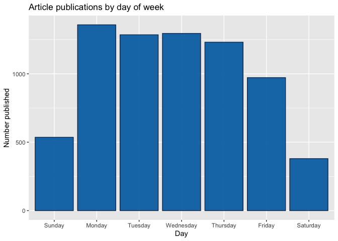

Analysis for the Entertainment Channel
================
Maks Nikiforov and Mark Austin
Due 10/31/2021

-   [Introduction](#introduction)
-   [Summarizations](#summarizations)
    -   [Numerical Summaries](#numerical-summaries)
    -   [Contingency Tables](#contingency-tables)
    -   [Plots](#plots)
-   [Modeling](#modeling)
-   [Model Comparisons](#model-comparisons)

``` r
# Read all data into a tibble
fullData<-read_csv("./data/OnlineNewsPopularity.csv")

# Eliminate non-predictive variables
reduceVarsData<-fullData %>% select(-url,-timedelta)
#Are there other vars we do not need to use??

#test code to be removed later
#params$channel<-"data_channel_is_bus"

#filter by the current params channel
channelData<-reduceVarsData %>% filter(eval(as.name(params$channel))==1) 

###Can now drop the data channel variables 
channelData<-channelData %>% select(-starts_with("data_channel"))
```

## Introduction

This page offers an exploratory data analysis of Entertainment articles
in the [online news popularity data
set](https://archive.ics.uci.edu/ml/datasets/Online+News+Popularity).
Two variables - `url` and `timedelta` - are non-predictive and have been
removed. The remaining 53 variables comprise 7057 observations, which
makes up 17.8 of the original data set.

The broader purpose of this analysis is predicated on using supervised
learning to predict a target variable - `shares`. To this end, the final
sections outline four unique models for predicting the number of article
shares and an assessment of their relative performance. Two models are
rooted in multiple linear regression analysis, which assesses
relationships between a response variable and two or more predictors.
The remaining models are based on random forest and boosted tree
techniques. The random forest method averages results from multiple
decision trees which are fitted with a random parameter subset. The
boosted tree method spurns averages in favor of results that stem from
weighted iterations (James et al., 2021).

## Summarizations

### Numerical Summaries

Summary information for shares grouped by whether an article was a
weekend article or not. This gives an idea of the center and spread for
shares.

``` r
channelData %>% group_by(is_weekend) %>% 
  summarise(Avg = mean(shares), Sd = sd(shares), 
    Median = median(shares), IQR =IQR(shares)) %>% kable(caption = "Summary Statistics for Shares")
```

| is_weekend |      Avg |       Sd | Median |  IQR |
|-----------:|---------:|---------:|-------:|-----:|
|          0 | 2869.537 | 8059.543 |   1100 | 1102 |
|          1 | 3647.273 | 6306.950 |   1650 | 2200 |

Summary Statistics for Shares

The table below highlights variables with the highest and most
significant correlations in the data set. This output may be considered
when analyzing covariance to control for potentially confounding
variables.

``` r
# Display top 10 highest correlations
covarianceDF <- corr_cross(df = channelData, max_pvalue = 0.05, top = 10, plot = 0) %>% 
  select(key, mix, corr, pvalue) %>% rename("Variable 1" = key, "Variable 2" = mix, 
                                            "Correlation" = corr, "p-value" = pvalue) 

# Display non-zero p-values
covarianceDF[4] <- format.pval(covarianceDF[4])

kable(covarianceDF)
```

| Variable 1                 | Variable 2                 | Correlation | p-value     |
|:---------------------------|:---------------------------|------------:|:------------|
| n_unique_tokens            | n_non_stop_unique_tokens   |    0.999973 | \< 2.22e-16 |
| n_unique_tokens            | n_non_stop_words           |    0.999920 | \< 2.22e-16 |
| n_non_stop_words           | n_non_stop_unique_tokens   |    0.999902 | \< 2.22e-16 |
| kw_max_min                 | kw_avg_min                 |    0.962390 | \< 2.22e-16 |
| kw_min_min                 | kw_max_max                 |   -0.867860 | \< 2.22e-16 |
| LDA_01                     | LDA_03                     |   -0.860914 | \< 2.22e-16 |
| self_reference_max_shares  | self_reference_avg_sharess |    0.830012 | \< 2.22e-16 |
| kw_max_avg                 | kw_avg_avg                 |    0.821630 | \< 2.22e-16 |
| global_rate_negative_words | rate_negative_words        |    0.790036 | \< 2.22e-16 |
| weekday_is_sunday          | is_weekend                 |    0.742330 | \< 2.22e-16 |

### Contingency Tables

``` r
##I want to try and split up shares then create a contingency table
```

### Plots

``` r
###this one is in progress, hopefully a scatter plot
g<-ggplot(data = channelData,
          aes(x= avg_negative_polarity,y=shares))
g + geom_point(aes(color=as.factor(is_weekend))) +
  scale_y_continuous(trans = "pseudo_log")
  
  scale_y_continuous(labels = scales::comma) 
```

``` r
###creating histogram of shares data 
g <- ggplot(channelData, aes( x = shares))
g + geom_histogram(binwidth=12000,color = "brown", fill = "green", 
  size = 1)  + labs(x="Article Shares", y="Pseudo Log of Count",
  title = "Histogram of Article Shares") +
  scale_y_continuous(trans = "pseudo_log",
                     breaks = c(0:3, 2000, 6000),minor_breaks = NULL) +
  scale_x_continuous(labels = scales::comma) 
```

<!-- -->

``` r
#depending on whether dr. post gives ok to do corrplot I'll do one of these for my 3rd graph
```

``` r
## Bar plot placeholder

# Subset columns to include only weekday_is_*
weekdayData <- channelData %>% select(starts_with("weekday_is"))

# Calculate sum of articles published in each week day
articlesPublished <- lapply(weekdayData, function(c) sum(c=="1"))

# Use factor to set specific order in bar plot
df <- data.frame(weekday=c("Monday", "Tuesday", "Wednesday", 
                           "Thursday", "Friday", "Saturday", "Sunday"),
                count=articlesPublished)
df$weekday = factor(df$weekday, levels = c("Sunday", "Monday", "Tuesday", "Wednesday", 
                           "Thursday", "Friday", "Saturday"))

# Create bar plot with total publications by day
weekdayBar <- ggplot(df, aes(x = weekday, y = articlesPublished)) + geom_bar(stat = "identity", color = "#123456", fill = "#0072B2") 
weekdayBar + labs(x = "Day", y = "Number published",
       title = "Article publications by day of week")
```

<!-- -->

## Modeling

``` r
#Using set.seed per suggestion so that work will be reproducible
set.seed(20)

dataIndex <-createDataPartition(channelData$shares, p = 0.7, list = FALSE)

channelTrain <-channelData[dataIndex,]
channelTest <-channelData[-dataIndex,]
```

``` r
# Seeing "Error in summary.connection(connection) : invalid connection" after
# previous parallel computing runs, stopCluster(cl) may not be working as expected
cl <- makePSOCKcluster(6)
registerDoParallel(cl)

# Linear regression 
lmFit1 <- train(shares ~ ., data = channelTrain,
               method = "lm",
               preProcess = c("center", "scale"),
               trControl = trainControl(method = "cv", 
                                        number = 5))


stopCluster(cl)

# Predict using test data
predictLM1 <- predict(lmFit1, newdata = channelTest)
```

    ## Warning in predict.lm(modelFit, newdata): prediction from a
    ## rank-deficient fit may be misleading

``` r
# Metrics
postResample(predictLM1, obs = channelTest$shares)
```

    ##         RMSE     Rsquared          MAE 
    ## 5.734943e+03 1.831495e-02 2.775672e+03

``` r
# Only RMSE
RMSE(channelTest$shares, predictLM1)
```

    ## [1] 5734.943

``` r
##without parallel code this was still running after 30 minutes so tried parallel next

##my pc has 8 cores so chose 5

##Followed Parallel instructions on caret page
##   https://topepo.github.io/caret/parallel-processing.html
##Even then it took 10 minutest to run
## and picked m=1 so not sure this is working correctly yet?

library(doParallel)
cl <- makePSOCKcluster(5)
registerDoParallel(cl)

rfFit <- train(shares ~ ., data = channelData,
               method = "rf",
               trControl = trainControl(method = "cv",
                                number = 5),
               tuneGrid = data.frame(mtry = 1:15))

stopCluster(cl)

rfFit
```

## Model Comparisons

This part needs to be automated. Maybe create a function and iterate
over these if they are similar?

<div id="refs" class="references csl-bib-body hanging-indent"
line-spacing="2">

<div id="ref-2021" class="csl-entry">

James, G., Witten, D., Hastie, T., & Tibshirani, R. (2021). *An
introduction to statistical learning*. Springer US.
<https://doi.org/10.1007/978-1-0716-1418-1>

</div>

</div>
