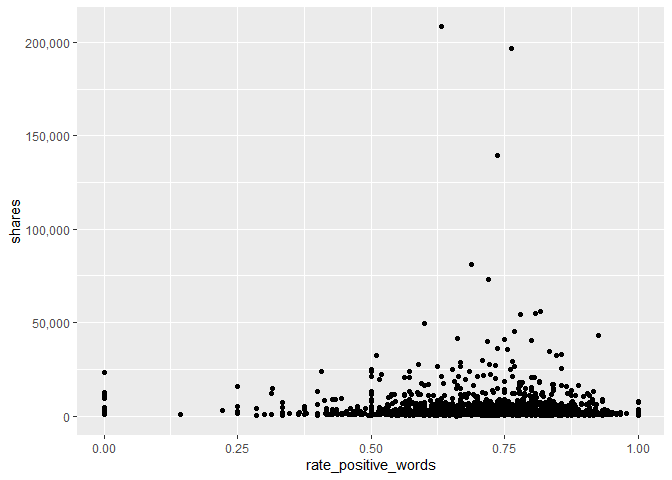

ProjectTwo
================
Maks Nikiforov and Mark Austin
Due 10/31/2021

-   [Introduction](#introduction)
-   [Data](#data)
-   [Summarizations](#summarizations)
-   [Modeling](#modeling)
-   [Model Comparisions](#model-comparisions)

## Introduction

## Data

``` r
fullData<-read_csv("./data/OnlineNewsPopularity.csv")
```

Using data\_channel\_is\_lifestyle

``` r
params$channel
```

    ## [1] "data_channel_is_lifestyle"

``` r
channelData<-fullData %>% filter(eval(as.name(params$channel))==1) 

##test code to confirm by str the filter is as expected
str(channelData)
```

    ## spec_tbl_df [2,099 x 61] (S3: spec_tbl_df/tbl_df/tbl/data.frame)
    ##  $ url                          : chr [1:2099] "http://mashable.com/2013/01/07/bodymedia-armbandgets-update/" "http://mashable.com/2013/01/07/crayon-creatures/" "http://mashable.com/2013/01/07/facebook-sick-app/" "http://mashable.com/2013/01/07/isp02-iphone-take-your-pulse/" ...
    ##  $ timedelta                    : num [1:2099] 731 731 731 731 731 731 731 731 730 729 ...
    ##  $ n_tokens_title               : num [1:2099] 8 10 11 10 8 11 10 6 12 11 ...
    ##  $ n_tokens_content             : num [1:2099] 960 187 103 243 204 315 1190 374 499 223 ...
    ##  $ n_unique_tokens              : num [1:2099] 0.418 0.667 0.689 0.619 0.586 ...
    ##  $ n_non_stop_words             : num [1:2099] 1 1 1 1 1 ...
    ##  $ n_non_stop_unique_tokens     : num [1:2099] 0.55 0.8 0.806 0.824 0.698 ...
    ##  $ num_hrefs                    : num [1:2099] 21 7 3 1 7 4 25 7 14 5 ...
    ##  $ num_self_hrefs               : num [1:2099] 20 0 1 1 2 4 24 0 1 3 ...
    ##  $ num_imgs                     : num [1:2099] 20 1 1 0 1 1 20 1 1 0 ...
    ##  $ num_videos                   : num [1:2099] 0 0 0 0 0 0 0 0 0 0 ...
    ##  $ average_token_length         : num [1:2099] 4.65 4.66 4.84 4.38 4.67 ...
    ##  $ num_keywords                 : num [1:2099] 10 7 6 10 8 10 8 8 10 6 ...
    ##  $ data_channel_is_lifestyle    : num [1:2099] 1 1 1 1 1 1 1 1 1 1 ...
    ##  $ data_channel_is_entertainment: num [1:2099] 0 0 0 0 0 0 0 0 0 0 ...
    ##  $ data_channel_is_bus          : num [1:2099] 0 0 0 0 0 0 0 0 0 0 ...
    ##  $ data_channel_is_socmed       : num [1:2099] 0 0 0 0 0 0 0 0 0 0 ...
    ##  $ data_channel_is_tech         : num [1:2099] 0 0 0 0 0 0 0 0 0 0 ...
    ##  $ data_channel_is_world        : num [1:2099] 0 0 0 0 0 0 0 0 0 0 ...
    ##  $ kw_min_min                   : num [1:2099] 0 0 0 0 0 0 0 0 217 217 ...
    ##  $ kw_max_min                   : num [1:2099] 0 0 0 0 0 0 0 0 1500 1900 ...
    ##  $ kw_avg_min                   : num [1:2099] 0 0 0 0 0 ...
    ##  $ kw_min_max                   : num [1:2099] 0 0 0 0 0 0 0 0 0 0 ...
    ##  $ kw_max_max                   : num [1:2099] 0 0 0 0 0 0 0 0 17100 17100 ...
    ##  $ kw_avg_max                   : num [1:2099] 0 0 0 0 0 ...
    ##  $ kw_min_avg                   : num [1:2099] 0 0 0 0 0 0 0 0 0 0 ...
    ##  $ kw_max_avg                   : num [1:2099] 0 0 0 0 0 ...
    ##  $ kw_avg_avg                   : num [1:2099] 0 0 0 0 0 ...
    ##  $ self_reference_min_shares    : num [1:2099] 545 0 5000 0 0 6200 545 0 1300 6700 ...
    ##  $ self_reference_max_shares    : num [1:2099] 16000 0 5000 0 0 6200 16000 0 1300 16700 ...
    ##  $ self_reference_avg_sharess   : num [1:2099] 3151 0 5000 0 0 ...
    ##  $ weekday_is_monday            : num [1:2099] 1 1 1 1 1 1 1 1 0 0 ...
    ##  $ weekday_is_tuesday           : num [1:2099] 0 0 0 0 0 0 0 0 1 0 ...
    ##  $ weekday_is_wednesday         : num [1:2099] 0 0 0 0 0 0 0 0 0 1 ...
    ##  $ weekday_is_thursday          : num [1:2099] 0 0 0 0 0 0 0 0 0 0 ...
    ##  $ weekday_is_friday            : num [1:2099] 0 0 0 0 0 0 0 0 0 0 ...
    ##  $ weekday_is_saturday          : num [1:2099] 0 0 0 0 0 0 0 0 0 0 ...
    ##  $ weekday_is_sunday            : num [1:2099] 0 0 0 0 0 0 0 0 0 0 ...
    ##  $ is_weekend                   : num [1:2099] 0 0 0 0 0 0 0 0 0 0 ...
    ##  $ LDA_00                       : num [1:2099] 0.0201 0.0286 0.4374 0.02 0.2115 ...
    ##  $ LDA_01                       : num [1:2099] 0.1147 0.0286 0.2004 0.02 0.0255 ...
    ##  $ LDA_02                       : num [1:2099] 0.02 0.0286 0.0335 0.02 0.0251 ...
    ##  $ LDA_03                       : num [1:2099] 0.02 0.0287 0.0334 0.02 0.0251 ...
    ##  $ LDA_04                       : num [1:2099] 0.825 0.885 0.295 0.92 0.713 ...
    ##  $ global_subjectivity          : num [1:2099] 0.514 0.477 0.424 0.518 0.652 ...
    ##  $ global_sentiment_polarity    : num [1:2099] 0.268 0.15 0.118 0.156 0.317 ...
    ##  $ global_rate_positive_words   : num [1:2099] 0.0802 0.0267 0.0291 0.0494 0.0735 ...
    ##  $ global_rate_negative_words   : num [1:2099] 0.01667 0.0107 0.00971 0.02058 0.0049 ...
    ##  $ rate_positive_words          : num [1:2099] 0.828 0.714 0.75 0.706 0.938 ...
    ##  $ rate_negative_words          : num [1:2099] 0.172 0.2857 0.25 0.2941 0.0625 ...
    ##  $ avg_positive_polarity        : num [1:2099] 0.402 0.435 0.278 0.333 0.422 ...
    ##  $ min_positive_polarity        : num [1:2099] 0.1 0.2 0.0333 0.1364 0.1 ...
    ##  $ max_positive_polarity        : num [1:2099] 1 0.7 0.5 0.6 1 0.5 1 0.8 0.5 0.5 ...
    ##  $ avg_negative_polarity        : num [1:2099] -0.224 -0.263 -0.125 -0.177 -0.4 ...
    ##  $ min_negative_polarity        : num [1:2099] -0.5 -0.4 -0.125 -0.312 -0.4 ...
    ##  $ max_negative_polarity        : num [1:2099] -0.05 -0.125 -0.125 -0.125 -0.4 -0.125 -0.05 -0.05 -0.1 -0.1 ...
    ##  $ title_subjectivity           : num [1:2099] 0 0 0.857 0 0 ...
    ##  $ title_sentiment_polarity     : num [1:2099] 0 0 -0.714 0 0 ...
    ##  $ abs_title_subjectivity       : num [1:2099] 0.5 0.5 0.357 0.5 0.5 ...
    ##  $ abs_title_sentiment_polarity : num [1:2099] 0 0 0.714 0 0 ...
    ##  $ shares                       : num [1:2099] 556 1900 5700 462 3600 343 507 552 1200 1900 ...
    ##  - attr(*, "spec")=
    ##   .. cols(
    ##   ..   url = col_character(),
    ##   ..   timedelta = col_double(),
    ##   ..   n_tokens_title = col_double(),
    ##   ..   n_tokens_content = col_double(),
    ##   ..   n_unique_tokens = col_double(),
    ##   ..   n_non_stop_words = col_double(),
    ##   ..   n_non_stop_unique_tokens = col_double(),
    ##   ..   num_hrefs = col_double(),
    ##   ..   num_self_hrefs = col_double(),
    ##   ..   num_imgs = col_double(),
    ##   ..   num_videos = col_double(),
    ##   ..   average_token_length = col_double(),
    ##   ..   num_keywords = col_double(),
    ##   ..   data_channel_is_lifestyle = col_double(),
    ##   ..   data_channel_is_entertainment = col_double(),
    ##   ..   data_channel_is_bus = col_double(),
    ##   ..   data_channel_is_socmed = col_double(),
    ##   ..   data_channel_is_tech = col_double(),
    ##   ..   data_channel_is_world = col_double(),
    ##   ..   kw_min_min = col_double(),
    ##   ..   kw_max_min = col_double(),
    ##   ..   kw_avg_min = col_double(),
    ##   ..   kw_min_max = col_double(),
    ##   ..   kw_max_max = col_double(),
    ##   ..   kw_avg_max = col_double(),
    ##   ..   kw_min_avg = col_double(),
    ##   ..   kw_max_avg = col_double(),
    ##   ..   kw_avg_avg = col_double(),
    ##   ..   self_reference_min_shares = col_double(),
    ##   ..   self_reference_max_shares = col_double(),
    ##   ..   self_reference_avg_sharess = col_double(),
    ##   ..   weekday_is_monday = col_double(),
    ##   ..   weekday_is_tuesday = col_double(),
    ##   ..   weekday_is_wednesday = col_double(),
    ##   ..   weekday_is_thursday = col_double(),
    ##   ..   weekday_is_friday = col_double(),
    ##   ..   weekday_is_saturday = col_double(),
    ##   ..   weekday_is_sunday = col_double(),
    ##   ..   is_weekend = col_double(),
    ##   ..   LDA_00 = col_double(),
    ##   ..   LDA_01 = col_double(),
    ##   ..   LDA_02 = col_double(),
    ##   ..   LDA_03 = col_double(),
    ##   ..   LDA_04 = col_double(),
    ##   ..   global_subjectivity = col_double(),
    ##   ..   global_sentiment_polarity = col_double(),
    ##   ..   global_rate_positive_words = col_double(),
    ##   ..   global_rate_negative_words = col_double(),
    ##   ..   rate_positive_words = col_double(),
    ##   ..   rate_negative_words = col_double(),
    ##   ..   avg_positive_polarity = col_double(),
    ##   ..   min_positive_polarity = col_double(),
    ##   ..   max_positive_polarity = col_double(),
    ##   ..   avg_negative_polarity = col_double(),
    ##   ..   min_negative_polarity = col_double(),
    ##   ..   max_negative_polarity = col_double(),
    ##   ..   title_subjectivity = col_double(),
    ##   ..   title_sentiment_polarity = col_double(),
    ##   ..   abs_title_subjectivity = col_double(),
    ##   ..   abs_title_sentiment_polarity = col_double(),
    ##   ..   shares = col_double()
    ##   .. )
    ##  - attr(*, "problems")=<externalptr>

``` r
###Need to drop other channel variables??
```

## Summarizations

``` r
##For now this is just a test graph to test out automation
g<-ggplot(data = channelData,
          aes(x=rate_positive_words,y=self_reference_avg_sharess))
g + geom_point()
```

<!-- -->

## Modeling

``` r
#Using set.seed per suggestion so that work will be reproducible
```

## Model Comparisions
