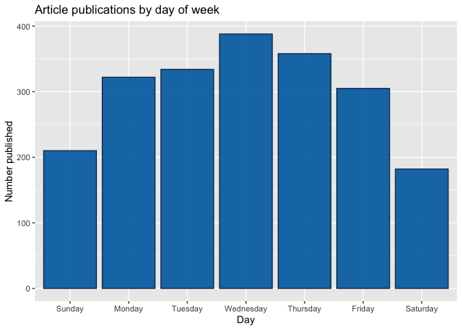

Analysis for the Lifestyle Channel
================
Maks Nikiforov and Mark Austin
Due 10/31/2021

-   [Introduction](#introduction)
-   [Import and Prepare Data](#import-and-prepare-data)
-   [Summarizations](#summarizations)
    -   [Numerical Summaries](#numerical-summaries)
    -   [Contingency Tables](#contingency-tables)
    -   [Plots](#plots)
-   [Modeling](#modeling)
-   [Model Comparisions](#model-comparisions)

## Introduction

## Import and Prepare Data

We begin by reading all data into a tibble using `readcsv`.

``` r
fullData<-read_csv("./data/OnlineNewsPopularity.csv")
```

The [data
documentation](https://archive.ics.uci.edu/ml/datasets/Online+News+Popularity)
says variables url and timedelta are nonpredictive so these can be
removed.

``` r
reduceVarsData<-fullData %>% select(-url,-timedelta)

#Are there other vars we do not need to use??
```

``` r
#test code to be removed later
#params$channel<-"data_channel_is_bus"

#filter by the current params channel
channelData<-reduceVarsData %>% filter(eval(as.name(params$channel))==1) 

###Can now drop the data channel variables 
channelData<-channelData %>% select(-starts_with("data_channel"))

# # Dichotomize popularity of articles based on median number of shares
# channelData %>% mutate(popular = NA)
# 
# for (i in 1:length(channelData)) {
#   if (channelData$shares[i] >= median(channelData$shares)) {
#     channelData$popular[i] = 1
#   }
#     else {
#       channelData$popular[i] = 0
#     }
#   }
```

## Summarizations

### Numerical Summaries

Summary information for shares. This gives an idea of the center and
spread for shares.

``` r
channelData %>% 
  summarise(Avg = mean(shares), Sd = sd(shares), 
    Median = median(shares), IQR =IQR(shares)) %>% kable(caption = "Summary Statistics for Shares")
```

|      Avg |       Sd | Median |  IQR |
|---------:|---------:|-------:|-----:|
| 3682.123 | 8885.017 |   1700 | 2150 |

Summary Statistics for Shares

### Contingency Tables

``` r
##I want to try and split up shares then create a contingency table
```

### Plots

``` r
##For now this is just a test graph to test out automation
g<-ggplot(data = channelData,
          aes(x=rate_positive_words,y=shares))
g + geom_point() +
  scale_y_continuous(labels = scales::comma) 
```

<!-- -->

``` r
###creating histogram of shares data 
g <- ggplot(channelData, aes( x = shares))
g + geom_histogram(binwidth=12000,color = "brown", fill = "green", 
  size = 1)  + labs(x="Article Shares", y="Pseudo Log of Count",
  title = "Histogram of Article Shares") +
  scale_y_continuous(trans = "pseudo_log",
                     breaks = c(0:3, 2000, 6000),minor_breaks = NULL) +
  scale_x_continuous(labels = scales::comma) 
```

<!-- -->

``` r
## Bar plot placeholder

# Subset columns to include only weekday_is_*
weekdayData <- channelData %>% select(starts_with("weekday_is"))

# Calculate sum of articles published in each week day
articlesPublished <- lapply(weekdayData, function(c) sum(c=="1"))

weekdayData
```

    ## # A tibble: 2,099 x 7
    ##    weekday_is_monday weekday_is_tuesday weekday_is_wednesday weekday_is_thursday
    ##                <dbl>              <dbl>                <dbl>               <dbl>
    ##  1                 1                  0                    0                   0
    ##  2                 1                  0                    0                   0
    ##  3                 1                  0                    0                   0
    ##  4                 1                  0                    0                   0
    ##  5                 1                  0                    0                   0
    ##  6                 1                  0                    0                   0
    ##  7                 1                  0                    0                   0
    ##  8                 1                  0                    0                   0
    ##  9                 0                  1                    0                   0
    ## 10                 0                  0                    1                   0
    ## # ... with 2,089 more rows, and 3 more variables: weekday_is_friday <dbl>,
    ## #   weekday_is_saturday <dbl>, weekday_is_sunday <dbl>

``` r
articlesPublished
```

    ## $weekday_is_monday
    ## [1] 322
    ## 
    ## $weekday_is_tuesday
    ## [1] 334
    ## 
    ## $weekday_is_wednesday
    ## [1] 388
    ## 
    ## $weekday_is_thursday
    ## [1] 358
    ## 
    ## $weekday_is_friday
    ## [1] 305
    ## 
    ## $weekday_is_saturday
    ## [1] 182
    ## 
    ## $weekday_is_sunday
    ## [1] 210

``` r
# Use factor to set specific order in bar plot
df <- data.frame(weekday=c("Monday", "Tuesday", "Wednesday", 
                           "Thursday", "Friday", "Saturday", "Sunday"),
                count=articlesPublished)
df$weekday = factor(df$weekday, levels = c("Sunday", "Monday", "Tuesday", "Wednesday", 
                           "Thursday", "Friday", "Saturday"))

# Create bar plot with total publications by day
weekdayBar <- ggplot(df, aes(x = weekday, y = articlesPublished)) + geom_bar(stat = "identity", color = "#123456", fill = "#0072B2") 
weekdayBar + labs(x = "Day", y = "Number published",
       title = "Article publications by day of week") 
```

<!-- -->

## Modeling

``` r
#Using set.seed per suggestion so that work will be reproducible
set.seed(20)

#channelData$popular <- as.factor(channelData$popular)

dataIndex <-createDataPartition(channelData$shares, p = 0.7, list = FALSE)

channelTrain <-channelData[dataIndex,]
channelTest <-channelData[-dataIndex,]
```

``` r
##without parallel code this was still running after 30 minutes so tried parallel next

##my pc has 8 cores so chose 5

##Followed Parallel instructions on caret page
##   https://topepo.github.io/caret/parallel-processing.html
##Even then it took 10 minutest to run
## and picked m=1 so not sure this is working correctly yet?

library(doParallel)
cl <- makePSOCKcluster(5)
registerDoParallel(cl)

rfFit <- train(shares ~ ., data = channelData,
               method = "rf",
               trControl = trainControl(method = "cv",
                                number = 5),
               tuneGrid = data.frame(mtry = 1:15))

stopCluster(cl)

rfFit
```

## Model Comparisions

This part needs to be automated. Maybe create a function and iterate
over these if they are similar?
