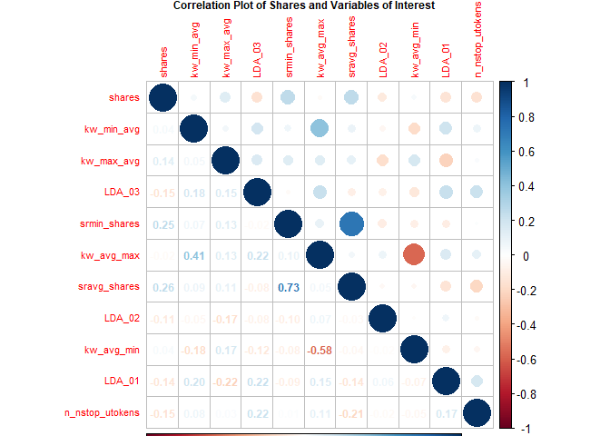
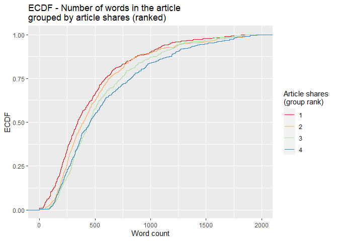

Analysis for the Social Media Channel
================
Maks Nikiforov and Mark Austin
Due 10/31/2021

-   [Introduction](#introduction)
-   [Summarizations](#summarizations)
    -   [Numerical Summaries](#numerical-summaries)
    -   [Contingency Tables](#contingency-tables)
    -   [Plots](#plots)
-   [Modeling](#modeling)
-   [Model Comparisons](#model-comparisons)
-   [References](#references)

``` r
# Read all data into a tibble
fullData<-read_csv("./data/OnlineNewsPopularity.csv")

# Eliminate non-predictive variables
reduceVarsData<-fullData %>% select(-url,-timedelta)
#Are there other vars we do not need to use??

#test code to be removed later
#params$channel<-"data_channel_is_bus"

#filter by the current params channel
channelData<-reduceVarsData %>% filter(eval(as.name(params$channel))==1) 

# Temp, will clean up
channelDataURL <- fullData %>% filter(eval(as.name(params$channel))==1)

###Can now drop the data channel variables 
channelData<-channelData %>% select(-starts_with("data_channel"))

# Temp, will clean up
channelDataURL <- fullData %>% filter(eval(as.name(params$channel))==1)
```

## Introduction

This page offers an exploratory data analysis of Social Media articles
in the [online news popularity data
set](https://archive.ics.uci.edu/ml/datasets/Online+News+Popularity).
The top ten articles in this category, based on the number of shares on
social media, include the following titles:

| Shares | Article title                                                       |
|-------:|:--------------------------------------------------------------------|
| 122800 | World’s First Sprout-Powered Battery Just Lit Up a Christmas Tree   |
|  59000 | Facebook Hashtags Not Open to Advertising – Yet                     |
|  57600 | 5 Fascinating Facts We Learned From Reddit This Week                |
|  57000 | The Most Memorable Brand Wins and Fails of 2013                     |
|  54100 | Even Superman Can’t Resist Photoshopping His Pics                   |
|  53100 | Watch the First-Ever YouTube Music Awards Here                      |
|  51900 | The 100 Most Beautiful Songs in the World, According to Reddit      |
|  47700 | Rebooted NASA Spacecraft Begins a New Mission 36 Years After Launch |
|  47400 | ‘Doctor Who’ Crash Course: 12 Essential Episodes                    |
|  41900 | The Tech Behind the Film ‘Gravity’                                  |

Two variables - `url` and `timedelta` - are non-predictive and have been
removed. The remaining 53 variables comprise 2323 observations, which
makes up 5.9 percent of the original data set. Fernandes et al., who
sourced the data, concentrated on article characteristics such as
verbosity and the polarity of content, publication day, the quantity of
included media, and keyword attributes (Fernandes et al., 2015). A
subset of these variables and the correlations between them are explored
in subsequent sections.

The broader purpose of this analysis is predicated on using supervised
learning to predict a target variable - `shares`. To this end, the final
sections outline four unique models for conducting such predictions and
an assessment of their relative performance. Two models are rooted in
multiple linear regression analysis, which assesses relationships
between a response variable and two or more predictors. The remaining
models are based on random forest and boosted tree techniques. The
random forest method averages results from multiple decision trees which
are fitted with a random parameter subset. The boosted tree method
spurns averages in favor of results that stem from weighted iterations
(James et al., 2021).

## Summarizations

### Numerical Summaries

The first table summarizes information for article shares grouped by
whether an article was a weekend article or not. This summary gives an
idea of the center and spread of `shares` across type of day group
levels.

``` r
channelData %>% 
  mutate(dayType=ifelse(is_weekend,"Weekend","Weekday")) %>%
  group_by(dayType) %>% 
  summarise(Avg = mean(shares), Sd = sd(shares), 
    Median = median(shares), IQR =IQR(shares)) %>% kable()
```

| dayType |      Avg |       Sd | Median |  IQR |
|:--------|---------:|---------:|-------:|-----:|
| Weekday | 3579.021 | 5525.015 |   2100 | 2400 |
| Weekend | 3948.079 | 5516.842 |   2400 | 2600 |

The next tables gives expands on the idea of the first table by grouping
`shares` by each day of the week. This summary gives an idea of the
center and spread of `shares` across day of the week group levels.

``` r
dowData<-channelData %>% select(starts_with("weekday_is"),shares) %>%
  mutate(dayofWeek=case_when(as.logical(weekday_is_monday)~"Monday",
                             as.logical(weekday_is_tuesday)~"Tuesday",
                             as.logical(weekday_is_wednesday)~"Wednesday",
                             as.logical(weekday_is_thursday)~"Thursday",
                             as.logical(weekday_is_friday)~"Friday",
                             as.logical(weekday_is_saturday)~"Saturday",
                             as.logical(weekday_is_sunday)~"Sunday")) %>%
  select(dayofWeek,shares)

dowLevels<-c("Monday","Tuesday","Wednesday",
             "Thursday","Friday","Saturday","Sunday")
dowData$dayofWeek<-factor(dowData$dayofWeek,levels = dowLevels)

dowData %>%  
  group_by(dayofWeek) %>% 
  summarise(Avg = mean(shares), Sd = sd(shares), 
    Median = median(shares), IQR =IQR(shares)) %>% kable()
```

| dayofWeek |      Avg |       Sd | Median |  IQR |
|:----------|---------:|---------:|-------:|-----:|
| Monday    | 4010.442 | 6045.547 |   2300 | 2800 |
| Tuesday   | 3503.290 | 6854.140 |   1900 | 2300 |
| Wednesday | 3508.510 | 5203.778 |   2100 | 2400 |
| Thursday  | 3092.168 | 3177.576 |   2000 | 2200 |
| Friday    | 4012.880 | 5845.955 |   2200 | 2525 |
| Saturday  | 3508.711 | 4119.288 |   2400 | 2100 |
| Sunday    | 4525.350 | 6913.255 |   2500 | 3100 |

The table below highlights variables with the highest and most
significant correlations in the data set. This output may be considered
when analyzing covariance to control for potentially confounding
variables.

``` r
# Display top 10 highest correlations
covarianceDF <- corr_cross(df = channelData, max_pvalue = 0.05, top = 10, plot = 0) %>% 
  select(key, mix, corr, pvalue) %>% rename("Variable 1" = key, "Variable 2" = mix, 
                                            "Correlation" = corr, "p-value" = pvalue) 

# Display non-zero p-values
covarianceDF[4] <- format.pval(covarianceDF[4])

kable(covarianceDF)
```

| Variable 1                    | Variable 2                      | Correlation | p-value       |
|:------------------------------|:--------------------------------|------------:|:--------------|
| kw\_max\_min                  | kw\_avg\_min                    |    0.976238 | &lt; 2.22e-16 |
| n\_unique\_tokens             | n\_non\_stop\_unique\_tokens    |    0.924183 | &lt; 2.22e-16 |
| kw\_max\_avg                  | kw\_avg\_avg                    |    0.879522 | &lt; 2.22e-16 |
| rate\_positive\_words         | rate\_negative\_words           |   -0.856612 | &lt; 2.22e-16 |
| kw\_min\_min                  | kw\_max\_max                    |   -0.851158 | &lt; 2.22e-16 |
| n\_non\_stop\_words           | average\_token\_length          |    0.801155 | &lt; 2.22e-16 |
| self\_reference\_max\_shares  | self\_reference\_avg\_sharess   |    0.794608 | &lt; 2.22e-16 |
| self\_reference\_min\_shares  | self\_reference\_avg\_sharess   |    0.789028 | &lt; 2.22e-16 |
| global\_rate\_negative\_words | rate\_negative\_words           |    0.776907 | &lt; 2.22e-16 |
| title\_subjectivity           | abs\_title\_sentiment\_polarity |    0.732438 | &lt; 2.22e-16 |

### Contingency Tables

The following contingency table displays counts and sums for the number
of article shares within given ranges by the day of week shared. Share
ranges were selected to illustrate lower, medium, and higher ranges of
shares. Examining these counts can show possible patterns of shares by
day or week and the range grouping for shares.

``` r
##dig.lab is needed to avoid R defaulting to scientific notation
kable(addmargins(table
                 (dowData$dayofWeek,cut(dowData$shares,
                  c(0,200,1000,10000,860000),dig.lab = 7))))
```

|           | (0,200\] | (200,1000\] | (1000,10000\] | (10000,860000\] |  Sum |
|:----------|---------:|------------:|--------------:|----------------:|-----:|
| Monday    |        2 |          34 |           279 |              22 |  337 |
| Tuesday   |        0 |          62 |           374 |              22 |  458 |
| Wednesday |        2 |          40 |           352 |              22 |  416 |
| Thursday  |        3 |          54 |           388 |              18 |  463 |
| Friday    |        0 |          33 |           273 |              26 |  332 |
| Saturday  |        0 |           7 |           165 |               8 |  180 |
| Sunday    |        0 |           9 |           116 |              12 |  137 |
| Sum       |        7 |         239 |          1947 |             130 | 2323 |

### Plots

The following histogram looks at the distribution of `shares`. A pseudo
log y scale with modified y break values was used so that article
`shares` with low frequency will appear. We can tell from the histogram
whether `shares` has a symmetric or skewed distribution. The
distribution is symmetric if the tails are the same around the center.
The distribution is right skewed if there is a long left tail and right
skewed if there is a long right tail.

``` r
###creating histogram of shares data 
##scales comma was used to avoid the default scientific notation
##pseudo log with breaks was used to make low frequency values 
## more visisble
g <- ggplot(channelData, aes( x = shares))
g + geom_histogram(binwidth=12000,color = "brown", fill = "green", 
  size = 1)  + labs(x="Article Shares", y="Pseudo Log of Count",
  title = "Histogram of Article Shares") +
  scale_y_continuous(trans = "pseudo_log",
                     breaks = c(0:3, 2000, 6000),minor_breaks = NULL) +
  scale_x_continuous(labels = scales::comma) 
```

<!-- -->

Fernandes et al highlight several variables in their random forest model
(Fernandes et al., 2015). The following variables from their top 11 were
included in the following correlation plot with variables in () being
renamed for this plot:
`shares`,`kw_min_avg`,`kw_max_avg`,`LDA_03`,`self_reference_min_shares`(`srmin_shares`),`kw_avg_max`,`self_reference_avg_sharess`(`sravg_shares`),`LDA_02`,`kw_avg_min`,`LDA_01`,`n_non_stop_unique_tokens`(`n_nstop_utokens`).  
The plot shows correlation with the response variable `shares` and the
other various combinations. Larger circles indicate stronger positive
(blue) or negative (red) correlation with correlation values on the
lower portion of the plot.

``` r
##Reduce variable name length for later plotting
## Otherwise var names overwrite Title no matter
##  how many other size tweaks were made
corrData<-channelData %>% 
  mutate(sravg_shares=self_reference_avg_sharess,
         srmin_shares=self_reference_min_shares,
         n_nstop_utokens=n_non_stop_unique_tokens)

Correlation<-cor(select(corrData, shares, kw_min_avg,
        kw_max_avg, LDA_03, srmin_shares,
        kw_avg_max, sravg_shares, LDA_02,
        kw_avg_min, LDA_01, n_nstop_utokens),
        method = "spearman")

corrplot(Correlation,type="upper",tl.pos="lt", tl.cex = .70)
corrplot(Correlation,type="lower",method="number",
         add=TRUE,diag=FALSE,tl.pos="n",tl.cex = .70,number.cex = .75,
         title = 
           "Correlation Plot of Shares and Variables of Interest",
         mar=c(0,0,.50,0),cex.main = .75)
```

<!-- -->

The following two scatterplots illustrate the relationship between
response article shares `shares` and predictor average keyword (max
shares) `kw_max_ave`. Both scatterplots plot these variables and add a
simple linear regression line to the graph.

For either graph, an upward relationship indicates higher average
keyword values tend towards more article shares. A negative relation
would indicate a lower average keyword values tend towards more article
shares.

In addition, both graphs use differing color for weekday and weekend
articles so that we can spot any possible trends with those values too.

The first scatterplot uses the default R generated axes so that
potential outliers or significant observations can be observed.

The second scatterplot reduces the scale of both axes to make it easier
to spot relationships for the majority of data that occur within these
bounds.

``` r
###Create new factor version of weekend variable 
### to use later in graphs
scatterData<-channelData %>% 
  mutate(dayType=ifelse(is_weekend,"Weekend","Weekday"))
scatterData$dayType<-as.factor(scatterData$dayType)

###First scatter plot with ALL data 
g<-ggplot(data = scatterData,
          aes(x= kw_max_avg,y=shares))
g + geom_point(aes(color=dayType)) +
  geom_smooth(method = lm) +
  scale_y_continuous(labels = scales::comma) +
  scale_x_continuous(labels = scales::comma) +
  labs(x="Avg. keyword (max. shares)", y="Article Shares",
       title = "Scatter Plot of Article Shares Versus Avg. keyword (max. shares)",color="") 
```

<!-- -->

``` r
###Second scatter plot with reduced axes
g<-ggplot(data = scatterData,
          aes(x= kw_max_avg,y=shares))
g + geom_point(aes(color=dayType)) +
  geom_smooth(method = lm) +
  ylim(0,10000) +
  xlim(0,20000) +
    labs(x="Avg. keyword (max. shares)", y="Article Shares",
       title = "Scatter Plot of Article Shares Versus Avg. keyword (max. shares)",
       color="")
```

<!-- -->

``` r
## Bar plot placeholder

# Subset columns to include only weekday_is_*
weekdayData <- channelData %>% select(starts_with("weekday_is"))

# Calculate sum of articles published in each week day
articlesPublished <- lapply(weekdayData, function(c) sum(c=="1"))

# Use factor to set specific order in bar plot
weekPubDF <- data.frame(weekday=c("Monday", "Tuesday", "Wednesday", 
                           "Thursday", "Friday", "Saturday", "Sunday"),
                count=articlesPublished)
weekPubDF$weekday = factor(weekPubDF$weekday, levels = c("Sunday", "Monday", "Tuesday", "Wednesday", 
                           "Thursday", "Friday", "Saturday"))

# Create bar plot with total publications by day
weekdayBar <- ggplot(weekPubDF, aes(x = weekday, y = articlesPublished)) + geom_bar(stat = "identity", color = "#123456", fill = "#0072B2") 
weekdayBar + labs(x = "Day", y = "Number published",
       title = "Article publications by day of week")
```

<!-- -->

The box plot below examines the day of article publication
(Monday-Sunday) and the associated distribution of article `shares`. The
combination of a relatively higher median on Saturday and Sunday, as
well as a comparably tall upper whisker, suggests that articles
published on weekends may circulate more frequently on social media than
articles published on weekdays.

``` r
# Subset columns to include only weekday_is_*, shares,
# create categorical variable, "day", denoting day of week (Mon-Sun)
medianShares <- channelData %>% select(starts_with("weekday_is"), shares) %>% mutate(day = NA)

# Populate "day"
for (i in 1:nrow(medianShares)) {
  if (medianShares$weekday_is_monday[i] == 1) {
    medianShares$day[i] = "Monday"
  }
  else if (medianShares$weekday_is_tuesday[i] == 1) {
    medianShares$day[i] = "Tuesday"
  }
  else if (medianShares$weekday_is_wednesday[i] == 1) {
    medianShares$day[i] = "Wednesday"
  }
  else if (medianShares$weekday_is_thursday[i] == 1) {
    medianShares$day[i] = "Thursday"
  }
  else if (medianShares$weekday_is_friday[i] == 1) {
    medianShares$day[i] = "Friday"
  }
  else if (medianShares$weekday_is_saturday[i] == 1) {
    medianShares$day[i] = "Saturday"
  }
  else if (medianShares$weekday_is_sunday[i] == 1) {
    medianShares$day[i] = "Sunday"
  }
  else {
    medianShares$day[i] = NA
  }
}

# Transform "day" into factor with levels to control order of boxplots
medianShares$day <- factor(medianShares$day, 
                           levels = c("Monday", "Tuesday", "Wednesday", 
                                      "Thursday", "Friday", "Saturday", "Sunday"))
```

``` r
# Plot distribution of shares for each day of the week
sharesBox <- ggplot(medianShares, aes(x = day, y = shares, fill = day))

sharesBox + geom_boxplot(outlier.shape = NA) + 
  # Exclude extreme outliers, limit range of y-axis
  coord_cartesian(ylim = quantile(medianShares$shares, c(0.1, 0.95))) +
  # Remove legend after coloration
  theme(legend.position = "none") +
  labs(x = "Day", y = "Shares",
       title = "Distribution of article shares for each publication day") + scale_fill_brewer(palette = "Spectral")
```

<!-- -->

For the empirical cumulative distribution function (ECDF) below, the
`dplyr` ranking function `ntile()` divides `shares` into four groups.
Observations with the fewest shares are placed into group 1, those with
the most shares are placed into group 4, and intermediaries reside in
groups 2 and 3. The horizontal axis lists word count, and the vertical
axis lists the percentage of content with that word count. A divergence
of the colored lines suggests that the number of words differs in
content with the fewest and most shares.

``` r
# Create variable to for binning the shares
binnedShares <- channelData %>% mutate(shareQuantile = ntile(channelData$shares, 4))
binnedShares <- binnedShares %>% mutate(totalMedia = num_imgs + num_videos)

# Render and label word count ECDF, group by binned shares
avgWordHisto <- ggplot(binnedShares, aes(x = n_tokens_content, colour = shareQuantile))
avgWordHisto + stat_ecdf(geom = "step", aes(color = as.character(shareQuantile))) +
  labs(title="ECDF - Number of words in the article \ngrouped by article shares (ranked)",
     y = "ECDF", x="Word count") + xlim(0,2000) + 
  scale_colour_brewer(palette = "Spectral", name = "Article shares \n(group rank)")
```

    ## Warning: Removed 102 rows containing non-finite values (stat_ecdf).

<!-- -->

## Modeling

``` r
#Using set.seed per suggestion so that work will be reproducible
set.seed(20)

dataIndex <-createDataPartition(channelData$shares, p = 0.7, list = FALSE)

channelTrain <-channelData[dataIndex,]
channelTest <-channelData[-dataIndex,]
```

``` r
# Seeing "Error in summary.connection(connection) : invalid connection" after
# previous parallel computing runs, stopCluster(cl) may not be working as expected
cl <- makePSOCKcluster(6)
registerDoParallel(cl)

# Linear regression 
lmFit1 <- train(shares ~ ., data = channelTrain,
               method = "lm",
               preProcess = c("center", "scale"),
               trControl = trainControl(method = "cv", 
                                        number = 5))


stopCluster(cl)

# Predict using test data
predictLM1 <- predict(lmFit1, newdata = channelTest)
```

    ## Warning in predict.lm(modelFit, newdata): prediction from a rank-deficient fit may
    ## be misleading

``` r
# Metrics
postResample(predictLM1, obs = channelTest$shares)
```

    ##         RMSE     Rsquared          MAE 
    ## 6.415630e+03 1.438419e-02 2.706086e+03

``` r
# Only RMSE
# RMSE(channelTest$shares, predictLM1)
```

``` r
##without parallel code this was still running after 30 minutes so tried parallel next

##my pc has 8 cores so chose 5

##Followed Parallel instructions on caret page
##   https://topepo.github.io/caret/parallel-processing.html
##Even then it took 10 minutest to run
## and picked m=1 so not sure this is working correctly yet?

cl <- makePSOCKcluster(5)
registerDoParallel(cl)

rfFit <- train(shares ~ ., data = channelData,
               method = "rf",
               trControl = trainControl(method = "cv",
                                number = 5),
               tuneGrid = data.frame(mtry = 1:15))

stopCluster(cl)

rfFit
```

``` r
# Seeing "Error in summary.connection(connection) : invalid connection"
# if I don't re-allocate cores for parallel computing
cl <- makePSOCKcluster(6)
registerDoParallel(cl)


# Boosted tree fit with tuneLength (let function decide parameter combinations)
boostedTreeFit <- train(shares ~ ., data = channelTrain,
               method = "gbm",
               preProcess = c("center", "scale"),
               trControl = trainControl(method = "cv", 
                                        number = 5),  
               tuneLength = 5)
```

    ## Iter   TrainDeviance   ValidDeviance   StepSize   Improve
    ##      1 26184479.2637             nan     0.1000 10793.1763
    ##      2 26014485.1166             nan     0.1000 95828.3722
    ##      3 25866859.5165             nan     0.1000 140765.1817
    ##      4 25802390.2857             nan     0.1000 7730.5243
    ##      5 25680640.9280             nan     0.1000 86401.0398
    ##      6 25399800.5262             nan     0.1000 132811.7434
    ##      7 25345246.8823             nan     0.1000 -15587.1773
    ##      8 25201072.9635             nan     0.1000 39462.9299
    ##      9 25075734.5121             nan     0.1000 -16664.2069
    ##     10 24985038.7208             nan     0.1000 50529.7084
    ##     20 24215459.0530             nan     0.1000 44641.5860
    ##     40 23408369.5127             nan     0.1000 -45361.2587
    ##     60 22778285.0330             nan     0.1000 -592.4596
    ##     80 22358006.0519             nan     0.1000 3326.3212
    ##    100 22055788.6444             nan     0.1000 -18059.6310

``` r
# Define tuning parameters based on $bestTune from the permutations above
nTrees <- boostedTreeFit$bestTune$n.trees
interactionDepth = boostedTreeFit$bestTune$interaction.depth
minObs = boostedTreeFit$bestTune$n.minobsinnode
shrinkParam <- boostedTreeFit$bestTune$shrinkage

# Boosted tree fit with defined parameters
bestBoostedTree <- train(shares ~ ., data = channelTrain,
               method = "gbm",
               preProcess = c("center", "scale"),
               trControl = trainControl(method = "cv", 
                                        number = 5),  
               tuneGrid = expand.grid(n.trees = nTrees, interaction.depth = interactionDepth,
                                      shrinkage = shrinkParam, n.minobsinnode = minObs))
```

    ## Iter   TrainDeviance   ValidDeviance   StepSize   Improve
    ##      1 26014030.4583             nan     0.1000 133660.6379
    ##      2 25849582.1863             nan     0.1000 162051.4015
    ##      3 25765336.4080             nan     0.1000 25933.5452
    ##      4 25637907.7796             nan     0.1000 94275.7437
    ##      5 25491757.2687             nan     0.1000 95119.2579
    ##      6 25397861.6007             nan     0.1000 90180.2850
    ##      7 25338238.8732             nan     0.1000 -49799.2468
    ##      8 25228644.2877             nan     0.1000 40379.8648
    ##      9 25145910.6841             nan     0.1000 17648.3356
    ##     10 25079220.3527             nan     0.1000 12539.0320
    ##     20 24293230.0841             nan     0.1000 -5641.1328
    ##     40 23381781.6691             nan     0.1000 -38452.1509
    ##     60 22922554.2690             nan     0.1000 21694.8766
    ##     80 22401752.3727             nan     0.1000 -36911.4927
    ##    100 22057109.2876             nan     0.1000 -21576.1271

``` r
stopCluster(cl)

# summary(bestBoostedTree)

# Predict using test data
predictGBM <- predict(bestBoostedTree, newdata = channelTest)

# Metrics
postResample(predictGBM, obs = channelTest$shares)
```

    ##         RMSE     Rsquared          MAE 
    ## 6.239984e+03 3.769112e-02 2.582658e+03

``` r
# Only RMSE
# RMSE(channelTest$shares, predictGBM)
```

## Model Comparisons

This part needs to be automated. Maybe create a function and iterate
over these if they are similar?

## References

<div id="refs" class="references csl-bib-body hanging-indent"
line-spacing="2">

<div id="ref-10.1007/978-3-319-23485-4_53" class="csl-entry">

Fernandes, K., Vinagre, P., & Cortez, P. (2015). A proactive intelligent
decision support system for predicting the popularity of online news. In
F. Pereira, P. Machado, E. Costa, & A. Cardoso (Eds.), *Progress in
artificial intelligence* (pp. 535–546). Springer International
Publishing.

</div>

<div id="ref-2021" class="csl-entry">

James, G., Witten, D., Hastie, T., & Tibshirani, R. (2021). *An
introduction to statistical learning*. Springer US.
<https://doi.org/10.1007/978-1-0716-1418-1>

</div>

</div>
