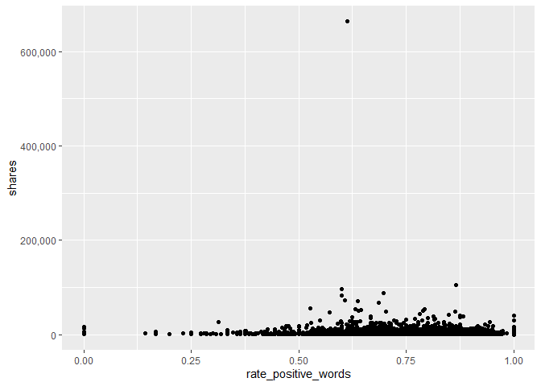

Analysis for the Tech Channel
================
Maks Nikiforov and Mark Austin
Due 10/31/2021

-   [Introduction](#introduction)
-   [Import and Prepare Data](#import-and-prepare-data)
-   [Summarizations](#summarizations)
    -   [Numerical Summaries](#numerical-summaries)
    -   [Contingency Tables](#contingency-tables)
    -   [Plots](#plots)
-   [Modeling](#modeling)
-   [Model Comparisions](#model-comparisions)

## Introduction

## Import and Prepare Data

We begin by reading all data into a tibble using `readcsv`.

``` r
fullData<-read_csv("./data/OnlineNewsPopularity.csv")
```

The [data
documentation](https://archive.ics.uci.edu/ml/datasets/Online+News+Popularity)
says variables url and timedelta are nonpredictive so these can be
removed.

``` r
reduceVarsData<-fullData %>% select(-url,-timedelta)

#Are there other vars we do not need to use??
```

``` r
#test code to be removed later
#params$channel<-"data_channel_is_bus"

#filter by the current params channel
channelData<-reduceVarsData %>% filter(eval(as.name(params$channel))==1) 

###Can now drop the data channel variables 
channelData<-channelData %>% select(-starts_with("data_channel"))
```

## Summarizations

### Numerical Summaries

Summary information for shares. This gives an idea of the center and
spread for shares.

``` r
channelData %>% 
  summarise(Avg = mean(shares), Sd = sd(shares), 
    Median = median(shares), IQR =IQR(shares)) %>% kable(caption = "Summary Statistics for Shares")
```

|      Avg |       Sd | Median |  IQR |
|---------:|---------:|-------:|-----:|
| 3072.283 | 9024.344 |   1700 | 1900 |

Summary Statistics for Shares

### Contingency Tables

``` r
##I want to try and split up shares then create a contingency table
```

### Plots

``` r
##For now this is just a test graph to test out automation
g<-ggplot(data = channelData,
          aes(x=rate_positive_words,y=shares))
g + geom_point() +
  scale_y_continuous(labels = scales::comma) 
```

<!-- -->

``` r
###I'm still working no this plot

###creating histogram of shares data 
summary(channelData$shares)
```

    ##    Min. 1st Qu.  Median    Mean 3rd Qu.    Max. 
    ##      36    1100    1700    3072    3000  663600

``` r
g <- ggplot(channelData, aes( x = shares))
g + geom_histogram(binwidth=12000,color = "brown", fill = "green", 
  size = 1)  + labs(x="Shares", y="Count",
  title = "Histogram Shares Counts") +
  scale_x_continuous(labels = scales::comma) 
```

<!-- -->

## Modeling

``` r
#Using set.seed per suggestion so that work will be reproducible
set.seed(20)

dataIndex <-createDataPartition(channelData$shares, p = 0.7, list = FALSE)

channelTrain <-channelData[dataIndex,]
channelTest <-channelData[-dataIndex,]
```

## Model Comparisions

This part needs to be automated. Maybe create a function and iterate
over these if they are similar?
