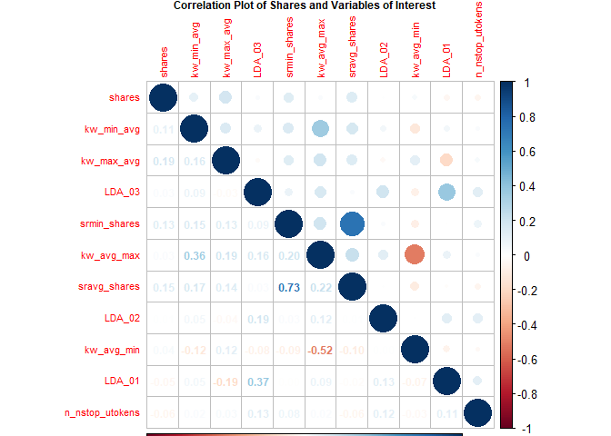

Analysis for the Tech Channel
================
Maks Nikiforov and Mark Austin
Due 10/31/2021

-   [Data Import](#data-import)
-   [Introduction](#introduction)
-   [Summarizations](#summarizations)
    -   [Numerical Summaries](#numerical-summaries)
    -   [Contingency Table](#contingency-table)
    -   [Plots](#plots)
-   [Modeling](#modeling)
    -   [Splitting Data](#splitting-data)
    -   [Linear Regression Models](#linear-regression-models)
    -   [Random Forest Model](#random-forest-model)
    -   [Boosted Tree Model](#boosted-tree-model)
-   [Model Comparisons](#model-comparisons)
-   [References](#references)

## Data Import

Data was imported first to allow for a more automated introduction.

``` r
# Read all data into a tibble
fullData<-read_csv("./data/OnlineNewsPopularity.csv")

# Eliminate non-predictive variables
reduceVarsData<-fullData %>% select(-url,-timedelta)

#test code for pre markdown automation
#params$channel<-"data_channel_is_bus"

#filter by the current params channel
channelData<-reduceVarsData %>% filter(eval(as.name(params$channel))==1) 

# Temp, will clean up
channelDataURL <- fullData %>% filter(eval(as.name(params$channel))==1)

###Can now drop the data channel variables 
channelData<-channelData %>% select(-starts_with("data_channel"))

# Temp, will clean up
channelDataURL <- fullData %>% filter(eval(as.name(params$channel))==1)
```

## Introduction

This page offers an exploratory data analysis of Tech articles in the
[online news popularity data
set](https://archive.ics.uci.edu/ml/datasets/Online+News+Popularity).
The top ten articles in this category, based on the number of shares on
social media, include the following titles:

| Shares | Article title                                                          |
|-------:|:-----------------------------------------------------------------------|
| 663600 | ‘I’m Able to Make My Mark’: 10 Employees Describe Startup Life         |
| 104100 | Visit 23 Museums and Zoos Free With Google Field Trip App              |
|  96100 | Instagram Acquires Video Filter App Luma                               |
|  88500 | Kiev Riots at Fever Pitch: The Fiery Scene in 30 Photos                |
|  83300 | Amazon Drops Kindle Fire Prices for Cyber Monday                       |
|  71800 | Learn to Code for Free With These 10 Online Resources                  |
|  70200 | Hilarious HelloFlo Ad Is the Only Good Thing About Periods             |
|  67800 | 16 Crucial Things J.K. Rowling Reveals in New Harry Potter Story       |
|  55200 | Google Wants You to Live 170 Years                                     |
|  53200 | All Eyes on Malala Yousafzai on Second International Day of the Girl   |
|  53200 | Whole Foods Partners With Instacart to Offer 1-Hour Grocery Deliveries |

Two variables - `url` and `timedelta` - are non-predictive and have been
removed. The remaining 53 variables comprise 7346 observations, which
makes up 18.5 percent of the original data set. Fernandes et al., who
sourced the data, concentrated on article characteristics such as
verbosity and the polarity of content, publication day, the quantity of
included media, and keyword attributes (Fernandes et al., 2015). A
subset of these variables and the correlations between them are explored
in subsequent sections.

The broader purpose of this analysis is predicated on using supervised
learning to predict a target variable - `shares`. To this end, the final
sections outline four unique models for conducting such predictions and
an assessment of their relative performance. Two models are rooted in
multiple linear regression analysis, which assesses relationships
between a response variable and two or more predictors. The remaining
models are based on random forest and boosted tree techniques. The
random forest method averages results from multiple decision trees which
are fitted with a random parameter subset. The boosted tree method
spurns averages in favor of results that stem from weighted iterations
(James et al., 2021).

## Summarizations

### Numerical Summaries

The first table summarizes information for article shares grouped by
whether an article was a weekend article or not. This summary gives an
idea of the center and spread of `shares` across type of day group
levels.

``` r
channelData %>% 
  mutate(dayType=ifelse(is_weekend,"Weekend","Weekday")) %>%
  group_by(dayType) %>% 
  summarise(Avg = mean(shares), Sd = sd(shares), 
    Median = median(shares), IQR =IQR(shares)) %>% kable()
```

| dayType |      Avg |       Sd | Median |  IQR |
|:--------|---------:|---------:|-------:|-----:|
| Weekday | 2974.685 | 9415.031 |   1600 | 1800 |
| Weekend | 3753.143 | 5540.198 |   2300 | 2300 |

The next tables gives expands on the idea of the first table by grouping
`shares` by each day of the week. This summary gives an idea of the
center and spread of `shares` across day of the week group levels.

``` r
dowData<-channelData %>% select(starts_with("weekday_is"),shares) %>%
  mutate(dayofWeek=case_when(as.logical(weekday_is_monday)~"Monday",
                             as.logical(weekday_is_tuesday)~"Tuesday",
                             as.logical(weekday_is_wednesday)~"Wednesday",
                             as.logical(weekday_is_thursday)~"Thursday",
                             as.logical(weekday_is_friday)~"Friday",
                             as.logical(weekday_is_saturday)~"Saturday",
                             as.logical(weekday_is_sunday)~"Sunday")) %>%
  select(dayofWeek,shares)

dowLevels<-c("Monday","Tuesday","Wednesday",
             "Thursday","Friday","Saturday","Sunday")
dowData$dayofWeek<-factor(dowData$dayofWeek,levels = dowLevels)

dowData %>%  
  group_by(dayofWeek) %>% 
  summarise(Avg = mean(shares), Sd = sd(shares), 
    Median = median(shares), IQR =IQR(shares)) %>% kable()
```

| dayofWeek |      Avg |        Sd | Median |  IQR |
|:----------|---------:|----------:|-------:|-----:|
| Monday    | 2821.483 |  3915.174 |   1600 | 1900 |
| Tuesday   | 2883.410 |  4722.322 |   1600 | 1700 |
| Wednesday | 3362.784 | 18144.784 |   1600 | 1900 |
| Thursday  | 2744.543 |  4164.736 |   1600 | 1775 |
| Friday    | 3050.813 |  5366.044 |   1800 | 1800 |
| Saturday  | 3615.453 |  5410.135 |   2300 | 2200 |
| Sunday    | 3935.687 |  5709.837 |   2400 | 2500 |

The table below highlights variables with the highest and most
significant correlations in the data set. This output may be considered
when analyzing covariance to control for potentially confounding
variables.

``` r
# Display top 10 highest correlations
covarianceDF <- corr_cross(df = channelData, max_pvalue = 0.05, top = 10, plot = 0) %>% 
  select(key, mix, corr, pvalue) %>% rename("Variable 1" = key, "Variable 2" = mix, 
                                            "Correlation" = corr, "p-value" = pvalue) 

# Display non-zero p-values
covarianceDF[4] <- format.pval(covarianceDF[4])

kable(covarianceDF)
```

| Variable 1                    | Variable 2                    | Correlation | p-value       |
|:------------------------------|:------------------------------|------------:|:--------------|
| kw\_max\_min                  | kw\_avg\_min                  |    0.932744 | &lt; 2.22e-16 |
| n\_unique\_tokens             | n\_non\_stop\_unique\_tokens  |    0.930561 | &lt; 2.22e-16 |
| rate\_positive\_words         | rate\_negative\_words         |   -0.918483 | &lt; 2.22e-16 |
| self\_reference\_max\_shares  | self\_reference\_avg\_sharess |    0.879430 | &lt; 2.22e-16 |
| self\_reference\_min\_shares  | self\_reference\_avg\_sharess |    0.830241 | &lt; 2.22e-16 |
| kw\_min\_min                  | kw\_max\_max                  |   -0.828040 | &lt; 2.22e-16 |
| global\_rate\_negative\_words | rate\_negative\_words         |    0.811086 | &lt; 2.22e-16 |
| kw\_max\_avg                  | kw\_avg\_avg                  |    0.752188 | &lt; 2.22e-16 |
| global\_rate\_negative\_words | rate\_positive\_words         |   -0.742238 | &lt; 2.22e-16 |
| n\_tokens\_content            | n\_unique\_tokens             |   -0.734905 | &lt; 2.22e-16 |

### Contingency Table

The following contingency table displays counts and sums for the number
of article shares within given ranges by the day of week shared. Share
ranges were selected to illustrate lower, medium, and higher ranges of
shares. Examining these counts can show possible patterns of shares by
day or week and the range grouping for shares.

``` r
##dig.lab is needed to avoid R defaulting to scientific notation
kable(addmargins(table
                 (dowData$dayofWeek,cut(dowData$shares,
                  c(0,200,1000,10000,860000),dig.lab = 7))))
```

|           | (0,200\] | (200,1000\] | (1000,10000\] | (10000,860000\] |  Sum |
|:----------|---------:|------------:|--------------:|----------------:|-----:|
| Monday    |        1 |         279 |           915 |              40 | 1235 |
| Tuesday   |        3 |         354 |          1047 |              70 | 1474 |
| Wednesday |        3 |         365 |           989 |              60 | 1417 |
| Thursday  |        3 |         326 |           939 |              42 | 1310 |
| Friday    |        4 |         160 |           785 |              40 |  989 |
| Saturday  |        2 |          22 |           474 |              27 |  525 |
| Sunday    |        0 |          26 |           342 |              28 |  396 |
| Sum       |       16 |        1532 |          5491 |             307 | 7346 |

### Plots

The following histogram looks at the distribution of `shares`. A pseudo
log y scale with modified y break values was used so that article
`shares` with low frequency will appear. We can tell from the histogram
whether `shares` has a symmetric or skewed distribution. The
distribution is symmetric if the tails are the same around the center.
The distribution is right skewed if there is a long left tail and right
skewed if there is a long right tail.

``` r
###creating histogram of shares data 
##scales comma was used to avoid the default scientific notation
##pseudo log with breaks was used to make low frequency values 
## more visisble
g <- ggplot(channelData, aes( x = shares))
g + geom_histogram(binwidth=12000,color = "brown", fill = "green", 
  size = 1)  + labs(x="Article Shares", y="Pseudo Log of Count",
  title = "Histogram of Article Shares") +
  scale_y_continuous(trans = "pseudo_log",
                     breaks = c(0:3, 2000, 6000),minor_breaks = NULL) +
  scale_x_continuous(labels = scales::comma) 
```

<!-- -->

Fernandes et al highlight several variables in their random forest model
(Fernandes et al., 2015). The following variables from their top 11 were
included in the following correlation plot with variables in () being
renamed for this plot:
`shares`,`kw_min_avg`,`kw_max_avg`,`LDA_03`,`self_reference_min_shares`(`srmin_shares`),`kw_avg_max`,`self_reference_avg_sharess`(`sravg_shares`),`LDA_02`,`kw_avg_min`,`LDA_01`,`n_non_stop_unique_tokens`(`n_nstop_utokens`).  
The plot shows correlation with the response variable `shares` and the
other various combinations. Larger circles indicate stronger positive
(blue) or negative (red) correlation with correlation values on the
lower portion of the plot.

``` r
##Reduce variable name length for later plotting
## Otherwise var names overwrite Title no matter
##  how many other size tweaks were made
corrData<-channelData %>% 
  mutate(sravg_shares=self_reference_avg_sharess,
         srmin_shares=self_reference_min_shares,
         n_nstop_utokens=n_non_stop_unique_tokens)

Correlation<-cor(select(corrData, shares, kw_min_avg,
        kw_max_avg, LDA_03, srmin_shares,
        kw_avg_max, sravg_shares, LDA_02,
        kw_avg_min, LDA_01, n_nstop_utokens),
        method = "spearman")

corrplot(Correlation,type="upper",tl.pos="lt", tl.cex = .70)
corrplot(Correlation,type="lower",method="number",
         add=TRUE,diag=FALSE,tl.pos="n",tl.cex = .70,number.cex = .75,
         title = 
           "Correlation Plot of Shares and Variables of Interest",
         mar=c(0,0,.50,0),cex.main = .75)
```

<!-- -->

The following two scatterplots illustrate the relationship between
response article shares `shares` and predictor average keyword (max
shares) `kw_max_ave`. `kw_max_ave` was chosen because it was one of the
potential predictors examined in the previous correlation plot.

Both scatterplots plot these variables and add a simple linear
regression line to the graph.

For either graph, an upward relationship indicates higher average
keyword values tend towards more article shares. A negative relation
would indicate a lower average keyword values tend towards more article
shares.

In addition, both graphs use differing color for weekday and weekend
articles so that we can spot any possible trends with those values too.

The first scatterplot uses the default R generated axes so that
potential outliers or significant observations can be observed.

The second scatterplot reduces the scale of both axes to make it easier
to spot relationships for the majority of data that occur within these
bounds.

``` r
###Create new factor version of weekend variable 
### to use later in graphs
scatterData<-channelData %>% 
  mutate(dayType=ifelse(is_weekend,"Weekend","Weekday"))
scatterData$dayType<-as.factor(scatterData$dayType)

###First scatter plot with ALL data 
g<-ggplot(data = scatterData,
          aes(x= kw_max_avg,y=shares))
g + geom_point(aes(color=dayType)) +
  geom_smooth(method = lm) +
  scale_y_continuous(labels = scales::comma) +
  scale_x_continuous(labels = scales::comma) +
  labs(x="Avg. keyword (max. shares)", y="Article Shares",
       title = "Scatter Plot of Article Shares Versus Avg. keyword (max. shares)",color="") 
```

<!-- -->

``` r
###Second scatter plot with reduced axes
g<-ggplot(data = scatterData,
          aes(x= kw_max_avg,y=shares))
g + geom_point(aes(color=dayType)) +
  geom_smooth(method = lm) +
  ylim(0,10000) +
  xlim(0,20000) +
    labs(x="Avg. keyword (max. shares)", y="Article Shares",
       title = "Scatter Plot of Article Shares Versus Avg. keyword (max. shares)",
       color="")
```

<!-- -->

``` r
## Bar plot placeholder

# Subset columns to include only weekday_is_*
weekdayData <- channelData %>% select(starts_with("weekday_is"))

# Calculate sum of articles published in each week day
articlesPublished <- lapply(weekdayData, function(c) sum(c=="1"))

# Use factor to set specific order in bar plot
weekPubDF <- data.frame(weekday=c("Monday", "Tuesday", "Wednesday", 
                           "Thursday", "Friday", "Saturday", "Sunday"),
                count=articlesPublished)
weekPubDF$weekday = factor(weekPubDF$weekday, levels = c("Sunday", "Monday", "Tuesday", "Wednesday", 
                           "Thursday", "Friday", "Saturday"))

# Create bar plot with total publications by day
weekdayBar <- ggplot(weekPubDF, aes(x = weekday, y = articlesPublished)) + geom_bar(stat = "identity", color = "#123456", fill = "#0072B2") 
weekdayBar + labs(x = "Day", y = "Number published",
       title = "Article publications by day of week")
```

<!-- -->

The box plot below examines the day of article publication
(Monday-Sunday) and the associated distribution of article `shares`. The
combination of a relatively higher median on Saturday and Sunday, as
well as a comparably tall upper whisker, suggests that articles
published on weekends may circulate more frequently on social media than
articles published on weekdays.

``` r
# Subset columns to include only weekday_is_*, shares,
# create categorical variable, "day", denoting day of week (Mon-Sun)
medianShares <- channelData %>% select(starts_with("weekday_is"), shares) %>% mutate(day = NA)

# Populate "day"
for (i in 1:nrow(medianShares)) {
  if (medianShares$weekday_is_monday[i] == 1) {
    medianShares$day[i] = "Monday"
  }
  else if (medianShares$weekday_is_tuesday[i] == 1) {
    medianShares$day[i] = "Tuesday"
  }
  else if (medianShares$weekday_is_wednesday[i] == 1) {
    medianShares$day[i] = "Wednesday"
  }
  else if (medianShares$weekday_is_thursday[i] == 1) {
    medianShares$day[i] = "Thursday"
  }
  else if (medianShares$weekday_is_friday[i] == 1) {
    medianShares$day[i] = "Friday"
  }
  else if (medianShares$weekday_is_saturday[i] == 1) {
    medianShares$day[i] = "Saturday"
  }
  else if (medianShares$weekday_is_sunday[i] == 1) {
    medianShares$day[i] = "Sunday"
  }
  else {
    medianShares$day[i] = NA
  }
}

# Transform "day" into factor with levels to control order of boxplots
medianShares$day <- factor(medianShares$day, 
                           levels = c("Monday", "Tuesday", "Wednesday", 
                                      "Thursday", "Friday", "Saturday", "Sunday"))
```

``` r
# Plot distribution of shares for each day of the week
sharesBox <- ggplot(medianShares, aes(x = day, y = shares, fill = day))

sharesBox + geom_boxplot(outlier.shape = NA) + 
  # Exclude extreme outliers, limit range of y-axis
  coord_cartesian(ylim = quantile(medianShares$shares, c(0.1, 0.95))) +
  # Remove legend after coloration
  theme(legend.position = "none") +
  labs(x = "Day", y = "Shares",
       title = "Distribution of article shares for each publication day") + scale_fill_brewer(palette = "Spectral")
```

<!-- -->

For the empirical cumulative distribution function (ECDF) below, the
`dplyr` ranking function `ntile()` divides `shares` into four groups.
Observations with the fewest shares are placed into group 1, those with
the most shares are placed into group 4, and intermediaries reside in
groups 2 and 3. The horizontal axis lists word count, and the vertical
axis lists the percentage of content with that word count. A divergence
of the colored lines suggests that the number of words differs in
content with the fewest and most shares.

``` r
# Create variable to for binning the shares
binnedShares <- channelData %>% mutate(shareQuantile = ntile(channelData$shares, 4))
binnedShares <- binnedShares %>% mutate(totalMedia = num_imgs + num_videos)

# Render and label word count ECDF, group by binned shares
avgWordHisto <- ggplot(binnedShares, aes(x = n_tokens_content, colour = shareQuantile))
avgWordHisto + stat_ecdf(geom = "step", aes(color = as.character(shareQuantile))) +
  labs(title="ECDF - Number of words in the article \ngrouped by article shares (ranked)",
     y = "ECDF", x="Word count") + xlim(0,2000) + 
  scale_colour_brewer(palette = "Spectral", name = "Article shares \n(group rank)")
```

    ## Warning: Removed 157 rows containing non-finite values (stat_ecdf).

<!-- -->

## Modeling

### Splitting Data

Per project requirements, the data for each channel are split with 70%
of the data becoming training data and 30% of the data becoming test
data.

``` r
#Using set.seed per suggestion so that work will be reproducible
set.seed(20)

dataIndex <-createDataPartition(channelData$shares, p = 0.7, list = FALSE)

channelTrain <-channelData[dataIndex,]
channelTest <-channelData[-dataIndex,]
```

### Linear Regression Models

Linear regression models describe a linear relationship between a
response variable and one or more explanatory variables. Models with one
explanatory variable are called simple linear regression models and
models with more than one explanatory variable are called multiple
linear regression models. Multiple linear regression models can include
polynomial and interaction terms. Each explanatory variable has an
associated estimated parameter. All linear regression models are linear
in the parameters.

For linear regression, explanatory variables can be continuous or
categorical. However, response variables are only continuous for linear
regression models.

Linear regression models are fit with training data by minimizing the
sum of squared errors. Model fitting results in a line for simple linear
regression and a saddle for multiple linear regression.

``` r
# Seeing "Error in summary.connection(connection) : invalid connection" after
# previous parallel computing runs, stopCluster(cl) may not be working as expected
cl <- makePSOCKcluster(6)
registerDoParallel(cl)

# Linear regression 
lmFit1 <- train(shares ~ ., data = channelTrain,
               method = "lm",
               preProcess = c("center", "scale"),
               trControl = trainControl(method = "cv", 
                                        number = 5))


stopCluster(cl)
```

``` r
cl <- makePSOCKcluster(6)
registerDoParallel(cl)

# Linear regression 
# Using same vars as in corrplot 
# See corrplot for why these were chosen
lmFit2 <- train(shares ~ kw_min_avg +
        kw_max_avg + LDA_03 + self_reference_min_shares +
        kw_avg_max + self_reference_avg_sharess + LDA_02 +
        kw_avg_min + LDA_01 + n_non_stop_unique_tokens, 
               data = channelTrain,
               method = "lm",
               preProcess = c("center", "scale"),
               trControl = trainControl(method = "cv", 
                                        number = 10))


stopCluster(cl)

lmFit2
```

### Random Forest Model

Random forest models aggregate results from many sample decision trees.
Those sample trees are produced using bootstrap samples created using
resampling with replacement. A tree is trained on each bootstrap sample,
resulting in a prediction based on that training sample data. Results
from all bootstrap samples are averaged to arrive at a final prediction.

Both bagging and random forest methods use bootstrap sampling with
decision trees. However, bagging includes all predictors which can lead
to less reduction in variance when strong predictors exist. Unlike
bagging, random forests do not use all predictors but use a random
subset of predictors for each bootstrap tree fit. Random forests usually
have a better fit than bagging models.

In this particular case, the response `shares` is continuous and we are
working with regression trees. The `mtry` tuning parameter controls how
many random predictors are used in the bootstrap samples. An `mtry` of 1
to 30 was chosen as a way to evaluate up to 30 predictors. These values
were chosen to work within available computing constraints. Five fold
cross validation is used to choose the optimal mtry value corresponding
to the lowest RMSE.

``` r
##Run time presented a challenge so parallel processing was used
##Followed Parallel instructions on caret page
##   https://topepo.github.io/caret/parallel-processing.html

##Various mtry values were tried with a 20 minute runtime goal
##  A 20 minute per channel runtime corresponds 
##  to a total of about 2 hours model fit for all 6 channels

##mtry 1:30 was chosen because it was close to 20 minutes
##mtry 1:20 had 10 minute runtime and 1:30 took 30 minutes

##repeatedcv was evaluated but took over 30 minutes 
## thus repeats were not used


cl <- makePSOCKcluster(6)
registerDoParallel(cl)

rfFit <- train(shares ~ ., data = channelTrain,
               method = "rf",
               preProcess = c("center", "scale"),
               trControl = trainControl(method = "cv",
                                number = 5),
               tuneGrid = data.frame(mtry = 1:30))

stopCluster(cl)

rfFit
```

    ## Random Forest 
    ## 
    ## 5145 samples
    ##   52 predictor
    ## 
    ## Pre-processing: centered (52), scaled (52) 
    ## Resampling: Cross-Validated (5 fold) 
    ## Summary of sample sizes: 4118, 4115, 4115, 4117, 4115 
    ## Resampling results across tuning parameters:
    ## 
    ##   mtry  RMSE      Rsquared    MAE     
    ##    1    7869.082  0.02944206  2424.246
    ##    2    7934.139  0.02659849  2471.017
    ##    3    7998.717  0.02429806  2504.566
    ##    4    8105.155  0.02118576  2527.109
    ##    5    8158.691  0.02174852  2547.132
    ##    6    8237.222  0.02010248  2558.983
    ##    7    8395.832  0.01765037  2582.756
    ##    8    8427.646  0.01705666  2581.530
    ##    9    8565.504  0.01578515  2612.642
    ##   10    8804.175  0.01378834  2627.282
    ##   11    8745.102  0.01673339  2622.694
    ##   12    8924.516  0.01380281  2631.404
    ##   13    8887.139  0.01471208  2631.517
    ##   14    8962.842  0.01435052  2636.057
    ##   15    8964.204  0.01525629  2646.480
    ##   16    9110.313  0.01296584  2666.004
    ##   17    9224.324  0.01250935  2671.390
    ##   18    9241.318  0.01252577  2674.008
    ##   19    9275.698  0.01258668  2670.785
    ##   20    9411.552  0.01403076  2695.507
    ##   21    9487.562  0.01413955  2692.911
    ##   22    9591.661  0.01307174  2690.142
    ##   23    9730.982  0.01261885  2723.414
    ##   24    9703.296  0.01407969  2706.527
    ##   25    9605.024  0.01468096  2716.055
    ##   26    9499.655  0.01480976  2704.017
    ##   27    9674.367  0.01517444  2703.785
    ##   28    9668.470  0.01445260  2697.882
    ##   29    9834.270  0.01498618  2722.515
    ##   30    9586.019  0.01619894  2700.417
    ## 
    ## RMSE was used to select the optimal model using the smallest value.
    ## The final value used for the model was mtry = 1.

After fitting the random forest model, the following variable importance
plot is created. The top ten most important predictors are plotted using
a scale of 0 to 100.

``` r
rfImp <- varImp(rfFit, scale = TRUE)
plot(rfImp,top = 10, main="Random Forest Model\nTop 10 Importance Plot")
```

<!-- -->

### Boosted Tree Model

Boosting is a general method whereby decision trees are grown
sequentially using residuals (the differences between observed values
and predicted values of a variable) as the response. Initial prediction
values start at 0 for all combinations of predictors, so that the first
set of residuals matches the observed values in our data. To mitigate
low bias and high variance, contributions from subsequent trees are
scaled with a shrinkage parameter, *λ*. The value of this parameter is
generally small (0.01 or 0.001), which results in slow tree growth and
tampers overfitting (James et al., 2021).

``` r
# Seeing "Error in summary.connection(connection) : invalid connection"
# if I don't re-allocate cores for parallel computing
cl <- makePSOCKcluster(6)
registerDoParallel(cl)


# Boosted tree fit with tuneLength (let function decide parameter combinations)
boostedTreeFit <- train(shares ~ ., data = channelTrain,
               method = "gbm",
               preProcess = c("center", "scale"),
               trControl = trainControl(method = "cv", 
                                        number = 5),  
               tuneLength = 5)
```

    ## Iter   TrainDeviance   ValidDeviance   StepSize   Improve
    ##      1 109381234.3456             nan     0.1000 42287.7480
    ##      2 109259302.9854             nan     0.1000 82440.1147
    ##      3 107952878.6786             nan     0.1000 -119661.0532
    ##      4 107762705.7614             nan     0.1000 158637.9618
    ##      5 106714403.7539             nan     0.1000 -246805.6528
    ##      6 106080384.9496             nan     0.1000 -194422.0950
    ##      7 105890357.8759             nan     0.1000 56655.2367
    ##      8 105239480.8539             nan     0.1000 -679207.0937
    ##      9 105335339.2685             nan     0.1000 -389205.4470
    ##     10 104849717.9119             nan     0.1000 -688884.9974
    ##     20 100299173.2114             nan     0.1000 545814.0687
    ##     40 93135195.2414             nan     0.1000 -567537.8741
    ##     50 91268088.5601             nan     0.1000 -750096.1446

``` r
# Define tuning parameters based on $bestTune from the permutations above
nTrees <- boostedTreeFit$bestTune$n.trees
interactionDepth = boostedTreeFit$bestTune$interaction.depth
minObs = boostedTreeFit$bestTune$n.minobsinnode
shrinkParam <- boostedTreeFit$bestTune$shrinkage

# Boosted tree fit with defined parameters
bestBoostedTree <- train(shares ~ ., data = channelTrain,
               method = "gbm",
               preProcess = c("center", "scale"),
               trControl = trainControl(method = "cv", 
                                        number = 5),  
               tuneGrid = expand.grid(n.trees = nTrees, interaction.depth = interactionDepth,
                                      shrinkage = shrinkParam, n.minobsinnode = minObs))
```

    ## Iter   TrainDeviance   ValidDeviance   StepSize   Improve
    ##      1 109371861.0234             nan     0.1000 125488.8575
    ##      2 109195951.9977             nan     0.1000 86584.1282
    ##      3 107679946.2162             nan     0.1000 -11333.3685
    ##      4 107557157.8583             nan     0.1000 111767.5956
    ##      5 106687455.2880             nan     0.1000 -247430.8891
    ##      6 106583581.1659             nan     0.1000 63981.2143
    ##      7 106413608.5233             nan     0.1000 -8816.7682
    ##      8 106549935.1270             nan     0.1000 -397646.4473
    ##      9 105765194.0504             nan     0.1000 -329999.9111
    ##     10 105254217.1698             nan     0.1000 -302624.7464
    ##     20 101543105.2993             nan     0.1000 248551.4841
    ##     40 95448924.2069             nan     0.1000 -604932.9373
    ##     50 89917072.2582             nan     0.1000 -426088.9426

``` r
stopCluster(cl)
```

## Model Comparisons

After models were fit with training data, we do predictions with testing
data. Finally, RMSE metrics are extracted and compared. The model with
lowest RMSE is presented as the winning model.

``` r
# Predict using test data
predictLM1 <- predict(lmFit1, newdata = channelTest)
```

    ## Warning in predict.lm(modelFit, newdata): prediction from a rank-deficient fit may
    ## be misleading

``` r
# Metrics
RMSELM1 <- postResample(predictLM1, obs = channelTest$shares)["RMSE"][[1]]
RMSELM1
```

    ## [1] 4153.777

``` r
# Store value for model comparison
modelPerformance <- tibble(RMSE = RMSELM1, Model = "Linear regression 1")
```

``` r
predictLM2 <- predict(lmFit2, newdata = channelTest)
RMSELM2<-postResample(predictLM2, channelTest$shares)["RMSE"][[1]]
RMSELM2
```

    ## [1] 4819.486

``` r
modelPerformance <- add_row(modelPerformance, RMSE = RMSELM2, Model = "Linear regression 2")
```

``` r
predictRF <- predict(rfFit, newdata = channelTest)
RMSERF<-postResample(predictRF, channelTest$shares)["RMSE"]
RMSERF
```

    ##     RMSE 
    ## 3869.007

``` r
modelPerformance <- add_row(modelPerformance, RMSE = RMSERF, Model = "Random forest")
```

``` r
#summary(bestBoostedTree)

# Predict using test data
predictGBM <- predict(bestBoostedTree, newdata = channelTest)

# Metrics
RMSEGBM <- postResample(predictGBM, obs = channelTest$shares)["RMSE"]
RMSEGBM
```

    ##     RMSE 
    ## 4332.354

``` r
modelPerformance <- add_row(modelPerformance, RMSE = RMSEGBM, Model = "Boosted tree")
```

``` r
# Select row with lowest value of RMSE.
selectModel <- modelPerformance %>% slice_min(RMSE)
selectModel
```

    ## # A tibble: 1 x 2
    ##    RMSE Model        
    ##   <dbl> <chr>        
    ## 1 3869. Random forest

Based on the preceding analyses with test data, the Random forest model
yields the lowest RMSE - 3869.0074517.

## References

<div id="refs" class="references csl-bib-body hanging-indent"
line-spacing="2">

<div id="ref-10.1007/978-3-319-23485-4_53" class="csl-entry">

Fernandes, K., Vinagre, P., & Cortez, P. (2015). A proactive intelligent
decision support system for predicting the popularity of online news. In
F. Pereira, P. Machado, E. Costa, & A. Cardoso (Eds.), *Progress in
artificial intelligence* (pp. 535–546). Springer International
Publishing.

</div>

<div id="ref-2021" class="csl-entry">

James, G., Witten, D., Hastie, T., & Tibshirani, R. (2021). *An
introduction to statistical learning*. Springer US.
<https://doi.org/10.1007/978-1-0716-1418-1>

</div>

</div>
