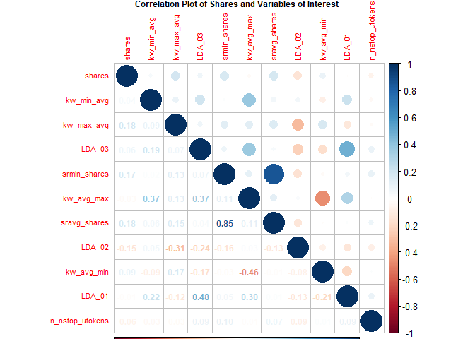
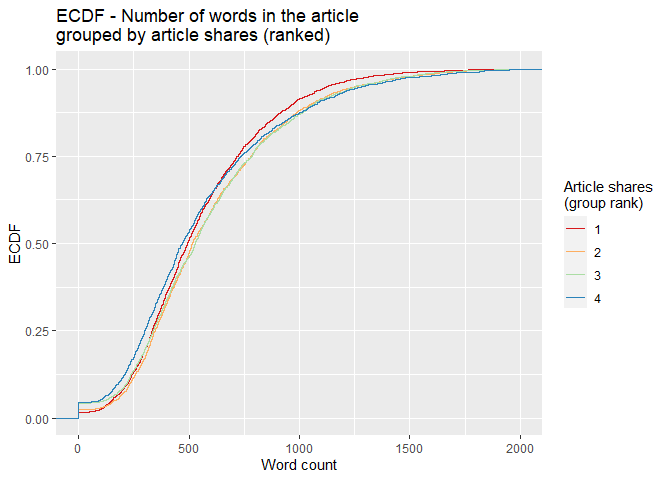

Analysis for the World Channel
================
Maks Nikiforov and Mark Austin
Due 10/31/2021

-   [Introduction](#introduction)
-   [Summarizations](#summarizations)
    -   [Numerical Summaries](#numerical-summaries)
    -   [Contingency Tables](#contingency-tables)
    -   [Plots](#plots)
-   [Modeling](#modeling)
-   [Model Comparisons](#model-comparisons)
-   [References](#references)

``` r
# Read all data into a tibble
fullData<-read_csv("./data/OnlineNewsPopularity.csv")

# Eliminate non-predictive variables
reduceVarsData<-fullData %>% select(-url,-timedelta)
#Are there other vars we do not need to use??

#test code to be removed later
#params$channel<-"data_channel_is_bus"

#filter by the current params channel
channelData<-reduceVarsData %>% filter(eval(as.name(params$channel))==1) 

# Temp, will clean up
channelDataURL <- fullData %>% filter(eval(as.name(params$channel))==1)

###Can now drop the data channel variables 
channelData<-channelData %>% select(-starts_with("data_channel"))

# Temp, will clean up
channelDataURL <- fullData %>% filter(eval(as.name(params$channel))==1)
```

## Introduction

This page offers an exploratory data analysis of World articles in the
[online news popularity data
set](https://archive.ics.uci.edu/ml/datasets/Online+News+Popularity).
The top ten articles in this category, based on the number of shares on
social media, include the following titles:

| Shares | Article title                                                                         |
|-------:|:--------------------------------------------------------------------------------------|
| 284700 | U.S. Will Now Monitor All Travelers From Ebola Zone for 21 Days                       |
| 141400 | Study: 54% of Online Adults Would Spend Tax Refunds on Travel                         |
| 128500 | Apple Fixes FaceTime Bug With iOS Update                                              |
| 115700 | Mystery drones fly over French nuclear sites                                          |
| 111300 | Prince Harry Reaches South Pole After 200-Mile Trek for Charity                       |
| 108400 | 12 Hours in ‘Utopia’: On the Set of Fox’s Newest Reality Show                         |
|  96500 | These Glasses Let You Play in 3D Virtual Worlds                                       |
|  84800 | Thousands of Children Orphaned by West Africa’s Ebola Crisis                          |
|  75500 | With Lima climate talks entering critical period, Kerry tries to rally leaders to act |
|  69300 | 11 People Who Should Cancel Their Gym Memberships                                     |

Two variables - `url` and `timedelta` - are non-predictive and have been
removed. The remaining 53 variables comprise 8427 observations, which
makes up 21.3 percent of the original data set. Fernandes et al., who
sourced the data, concentrated on article characteristics such as
verbosity and the polarity of content, publication day, the quantity of
included media, and keyword attributes (Fernandes et al., 2015). A
subset of these variables and the correlations between them are explored
in subsequent sections.

The broader purpose of this analysis is predicated on using supervised
learning to predict a target variable - `shares`. To this end, the final
sections outline four unique models for conducting such predictions and
an assessment of their relative performance. Two models are rooted in
multiple linear regression analysis, which assesses relationships
between a response variable and two or more predictors. The remaining
models are based on random forest and boosted tree techniques. The
random forest method averages results from multiple decision trees which
are fitted with a random parameter subset. The boosted tree method
spurns averages in favor of results that stem from weighted iterations
(James et al., 2021).

## Summarizations

### Numerical Summaries

The first table summarizes information for article shares grouped by
whether an article was a weekend article or not. This summary gives an
idea of the center and spread of `shares` across type of day group
levels.

``` r
channelData %>% 
  mutate(dayType=ifelse(is_weekend,"Weekend","Weekday")) %>%
  group_by(dayType) %>% 
  summarise(Avg = mean(shares), Sd = sd(shares), 
    Median = median(shares), IQR =IQR(shares)) %>% kable()
```

| dayType |      Avg |       Sd | Median |  IQR |
|:--------|---------:|---------:|-------:|-----:|
| Weekday | 2229.789 | 6271.037 |   1100 | 1000 |
| Weekend | 2679.424 | 4666.479 |   1500 | 1300 |

The next tables gives expands on the idea of the first table by grouping
`shares` by each day of the week. This summary gives an idea of the
center and spread of `shares` across day of the week group levels.

``` r
dowData<-channelData %>% select(starts_with("weekday_is"),shares) %>%
  mutate(dayofWeek=case_when(as.logical(weekday_is_monday)~"Monday",
                             as.logical(weekday_is_tuesday)~"Tuesday",
                             as.logical(weekday_is_wednesday)~"Wednesday",
                             as.logical(weekday_is_thursday)~"Thursday",
                             as.logical(weekday_is_friday)~"Friday",
                             as.logical(weekday_is_saturday)~"Saturday",
                             as.logical(weekday_is_sunday)~"Sunday")) %>%
  select(dayofWeek,shares)

dowLevels<-c("Monday","Tuesday","Wednesday",
             "Thursday","Friday","Saturday","Sunday")
dowData$dayofWeek<-factor(dowData$dayofWeek,levels = dowLevels)

dowData %>%  
  group_by(dayofWeek) %>% 
  summarise(Avg = mean(shares), Sd = sd(shares), 
    Median = median(shares), IQR =IQR(shares)) %>% kable()
```

| dayofWeek |      Avg |       Sd | Median |     IQR |
|:----------|---------:|---------:|-------:|--------:|
| Monday    | 2456.054 | 6864.797 |   1100 |  968.25 |
| Tuesday   | 2220.135 | 5677.929 |   1100 |  929.00 |
| Wednesday | 1879.788 | 3135.450 |   1100 |  919.00 |
| Thursday  | 2394.008 | 8584.880 |   1100 |  911.00 |
| Friday    | 2228.411 | 5792.085 |   1100 | 1052.00 |
| Saturday  | 2760.202 | 4864.959 |   1500 | 1500.00 |
| Sunday    | 2605.483 | 4480.142 |   1400 | 1200.00 |

The table below highlights variables with the highest and most
significant correlations in the data set. This output may be considered
when analyzing covariance to control for potentially confounding
variables.

``` r
# Display top 10 highest correlations
covarianceDF <- corr_cross(df = channelData, max_pvalue = 0.05, top = 10, plot = 0) %>% 
  select(key, mix, corr, pvalue) %>% rename("Variable 1" = key, "Variable 2" = mix, 
                                            "Correlation" = corr, "p-value" = pvalue) 

# Display non-zero p-values
covarianceDF[4] <- format.pval(covarianceDF[4])

kable(covarianceDF)
```

| Variable 1                    | Variable 2                    | Correlation | p-value       |
|:------------------------------|:------------------------------|------------:|:--------------|
| n\_non\_stop\_words           | average\_token\_length        |    0.963012 | &lt; 2.22e-16 |
| kw\_max\_min                  | kw\_avg\_min                  |    0.955981 | &lt; 2.22e-16 |
| n\_unique\_tokens             | n\_non\_stop\_unique\_tokens  |    0.952642 | &lt; 2.22e-16 |
| kw\_min\_min                  | kw\_max\_max                  |   -0.872529 | &lt; 2.22e-16 |
| self\_reference\_max\_shares  | self\_reference\_avg\_sharess |    0.858039 | &lt; 2.22e-16 |
| self\_reference\_min\_shares  | self\_reference\_avg\_sharess |    0.846895 | &lt; 2.22e-16 |
| kw\_max\_avg                  | kw\_avg\_avg                  |    0.821122 | &lt; 2.22e-16 |
| n\_non\_stop\_words           | n\_non\_stop\_unique\_tokens  |    0.815246 | &lt; 2.22e-16 |
| n\_non\_stop\_unique\_tokens  | average\_token\_length        |    0.772018 | &lt; 2.22e-16 |
| global\_rate\_negative\_words | rate\_negative\_words         |    0.765871 | &lt; 2.22e-16 |

### Contingency Tables

The following contingency table displays counts and sums for the number
of article shares within given ranges by the day of week shared. Share
ranges were selected to illustrate lower, medium, and higher ranges of
shares. Examining these counts can show possible patterns of shares by
day or week and the range grouping for shares.

``` r
##dig.lab is needed to avoid R defaulting to scientific notation
kable(addmargins(table
                 (dowData$dayofWeek,cut(dowData$shares,
                  c(0,200,1000,10000,860000),dig.lab = 7))))
```

|           | (0,200\] | (200,1000\] | (1000,10000\] | (10000,860000\] |  Sum |
|:----------|---------:|------------:|--------------:|----------------:|-----:|
| Monday    |       11 |         607 |           693 |              45 | 1356 |
| Tuesday   |       12 |         750 |           740 |              44 | 1546 |
| Wednesday |       12 |         761 |           757 |              35 | 1565 |
| Thursday  |       15 |         740 |           762 |              52 | 1569 |
| Friday    |       14 |         548 |           707 |              36 | 1305 |
| Saturday  |       12 |         116 |           369 |              22 |  519 |
| Sunday    |        2 |         121 |           424 |              20 |  567 |
| Sum       |       78 |        3643 |          4452 |             254 | 8427 |

### Plots

The following histogram looks at the distribution of `shares`. A pseudo
log y scale with modified y break values was used so that article
`shares` with low frequency will appear. We can tell from the histogram
whether `shares` has a symmetric or skewed distribution. The
distribution is symmetric if the tails are the same around the center.
The distribution is right skewed if there is a long left tail and right
skewed if there is a long right tail.

``` r
###creating histogram of shares data 
##scales comma was used to avoid the default scientific notation
##pseudo log with breaks was used to make low frequency values 
## more visisble
g <- ggplot(channelData, aes( x = shares))
g + geom_histogram(binwidth=12000,color = "brown", fill = "green", 
  size = 1)  + labs(x="Article Shares", y="Pseudo Log of Count",
  title = "Histogram of Article Shares") +
  scale_y_continuous(trans = "pseudo_log",
                     breaks = c(0:3, 2000, 6000),minor_breaks = NULL) +
  scale_x_continuous(labels = scales::comma) 
```

<!-- -->

Fernandes et al highlight several variables in their random forest model
(Fernandes et al., 2015). The following variables from their top 11 were
included in the following correlation plot:
`shares`,`kw_min_avg`,`kw_max_avg`,`LDA_03`,`self_reference_min_shares`,`kw_avg_max`,`self_reference_avg_sharess`,`LDA_02`,`kw_avg_min`,`LDA_01`,`n_non_stop_unique_tokens`.  
The plot shows correlation with the response variable `shares` and the
other various combinations. Larger circles indicate stronger positive
(blue) or negative (red) correlation with correlation values on the
lower portion of the plot.

``` r
Correlation<-cor(select(channelData, shares, kw_min_avg,
        kw_max_avg, LDA_03, self_reference_min_shares,
        kw_avg_max, self_reference_avg_sharess, LDA_02,
        kw_avg_min, LDA_01, n_non_stop_unique_tokens),
        method = "spearman")


corrplot(Correlation,type="upper",tl.pos="lt", tl.cex = .75)
corrplot(Correlation,type="lower",method="number",
         add=TRUE,diag=FALSE,tl.pos="n",tl.cex = .75,number.cex = .75)
```

<!-- -->

``` r
###this one is in progress, hopefully a scatter plot
g<-ggplot(data = channelData,
          aes(x= avg_negative_polarity,y=shares))
g + geom_point(aes(color=as.factor(is_weekend))) +
  scale_y_continuous(trans = "pseudo_log")
  
  scale_y_continuous(labels = scales::comma) 
```

``` r
## Bar plot placeholder

# Subset columns to include only weekday_is_*
weekdayData <- channelData %>% select(starts_with("weekday_is"))

# Calculate sum of articles published in each week day
articlesPublished <- lapply(weekdayData, function(c) sum(c=="1"))

# Use factor to set specific order in bar plot
weekPubDF <- data.frame(weekday=c("Monday", "Tuesday", "Wednesday", 
                           "Thursday", "Friday", "Saturday", "Sunday"),
                count=articlesPublished)
weekPubDF$weekday = factor(weekPubDF$weekday, levels = c("Sunday", "Monday", "Tuesday", "Wednesday", 
                           "Thursday", "Friday", "Saturday"))

# Create bar plot with total publications by day
weekdayBar <- ggplot(weekPubDF, aes(x = weekday, y = articlesPublished)) + geom_bar(stat = "identity", color = "#123456", fill = "#0072B2") 
weekdayBar + labs(x = "Day", y = "Number published",
       title = "Article publications by day of week")
```

<!-- -->

The box plot below examines the day of article publication
(Monday-Sunday) and the associated distribution of article `shares`. The
combination of a relatively higher median on Saturday and Sunday, as
well as a comparably tall upper whisker, suggests that articles
published on weekends may circulate more frequently on social media than
articles published on weekdays.

``` r
# Subset columns to include only weekday_is_*, shares,
# create categorical variable, "day", denoting day of week (Mon-Sun)
medianShares <- channelData %>% select(starts_with("weekday_is"), shares) %>% mutate(day = NA)

# Populate "day"
for (i in 1:nrow(medianShares)) {
  if (medianShares$weekday_is_monday[i] == 1) {
    medianShares$day[i] = "Monday"
  }
  else if (medianShares$weekday_is_tuesday[i] == 1) {
    medianShares$day[i] = "Tuesday"
  }
  else if (medianShares$weekday_is_wednesday[i] == 1) {
    medianShares$day[i] = "Wednesday"
  }
  else if (medianShares$weekday_is_thursday[i] == 1) {
    medianShares$day[i] = "Thursday"
  }
  else if (medianShares$weekday_is_friday[i] == 1) {
    medianShares$day[i] = "Friday"
  }
  else if (medianShares$weekday_is_saturday[i] == 1) {
    medianShares$day[i] = "Saturday"
  }
  else if (medianShares$weekday_is_sunday[i] == 1) {
    medianShares$day[i] = "Sunday"
  }
  else {
    medianShares$day[i] = NA
  }
}

# Transform "day" into factor with levels to control order of boxplots
medianShares$day <- factor(medianShares$day, 
                           levels = c("Monday", "Tuesday", "Wednesday", 
                                      "Thursday", "Friday", "Saturday", "Sunday"))
```

``` r
# Plot distribution of shares for each day of the week
sharesBox <- ggplot(medianShares, aes(x = day, y = shares, fill = day))

sharesBox + geom_boxplot(outlier.shape = NA) + 
  # Exclude extreme outliers, limit range of y-axis
  coord_cartesian(ylim = quantile(medianShares$shares, c(0.1, 0.95))) +
  # Remove legend after coloration
  theme(legend.position = "none") +
  labs(x = "Day", y = "Shares",
       title = "Distribution of article shares for each publication day") + scale_fill_brewer(palette = "Spectral")
```

<!-- -->

For the empirical cumulative distribution function (ECDF) below, the
`dplyr` ranking function `ntile()` divides `shares` into four groups.
Observations with the fewest shares are placed into group 1, those with
the most shares are placed into group 4, and intermediaries reside in
groups 2 and 3. The horizontal axis lists word count, and the vertical
axis lists the percentage of content with that word count. A divergence
of the colored lines suggests that the number of words differs in
content with the fewest and most shares.

``` r
# Create variable to for binning the shares
binnedShares <- channelData %>% mutate(shareQuantile = ntile(channelData$shares, 4))
binnedShares <- binnedShares %>% mutate(totalMedia = num_imgs + num_videos)

# Render and label word count ECDF, group by binned shares
avgWordHisto <- ggplot(binnedShares, aes(x = n_tokens_content, colour = shareQuantile))
avgWordHisto + stat_ecdf(geom = "step", aes(color = as.character(shareQuantile))) +
  labs(title="ECDF - Number of words in the article \ngrouped by article shares (ranked)",
     y = "ECDF", x="Word count") + xlim(0,2000) + 
  scale_colour_brewer(palette = "Spectral", name = "Article shares \n(group rank)")
```

    ## Warning: Removed 97 rows containing non-finite values (stat_ecdf).

<!-- -->

## Modeling

``` r
#Using set.seed per suggestion so that work will be reproducible
set.seed(20)

dataIndex <-createDataPartition(channelData$shares, p = 0.7, list = FALSE)

channelTrain <-channelData[dataIndex,]
channelTest <-channelData[-dataIndex,]
```

``` r
# Seeing "Error in summary.connection(connection) : invalid connection" after
# previous parallel computing runs, stopCluster(cl) may not be working as expected
cl <- makePSOCKcluster(6)
registerDoParallel(cl)

# Linear regression 
lmFit1 <- train(shares ~ ., data = channelTrain,
               method = "lm",
               preProcess = c("center", "scale"),
               trControl = trainControl(method = "cv", 
                                        number = 5))


stopCluster(cl)

# Predict using test data
predictLM1 <- predict(lmFit1, newdata = channelTest)
```

    ## Warning in predict.lm(modelFit, newdata): prediction from a rank-deficient fit may
    ## be misleading

``` r
# Metrics
postResample(predictLM1, obs = channelTest$shares)
```

    ##         RMSE     Rsquared          MAE 
    ## 7.531881e+03 1.844016e-02 2.041776e+03

``` r
# Only RMSE
# RMSE(channelTest$shares, predictLM1)
```

``` r
##without parallel code this was still running after 30 minutes so tried parallel next

##my pc has 8 cores so chose 5

##Followed Parallel instructions on caret page
##   https://topepo.github.io/caret/parallel-processing.html
##Even then it took 10 minutest to run
## and picked m=1 so not sure this is working correctly yet?

cl <- makePSOCKcluster(5)
registerDoParallel(cl)

rfFit <- train(shares ~ ., data = channelData,
               method = "rf",
               trControl = trainControl(method = "cv",
                                number = 5),
               tuneGrid = data.frame(mtry = 1:15))

stopCluster(cl)

rfFit
```

``` r
# Seeing "Error in summary.connection(connection) : invalid connection"
# if I don't re-allocate cores for parallel computing
cl <- makePSOCKcluster(6)
registerDoParallel(cl)


# Boosted tree fit with tuneLength (let function decide parameter combinations)
boostedTreeFit <- train(shares ~ ., data = channelTrain,
               method = "gbm",
               preProcess = c("center", "scale"),
               trControl = trainControl(method = "cv", 
                                        number = 5),  
               tuneLength = 5)
```

    ## Iter   TrainDeviance   ValidDeviance   StepSize   Improve
    ##      1 28141992.1046             nan     0.1000 48720.7106
    ##      2 28076686.8360             nan     0.1000 66772.7428
    ##      3 27978662.9809             nan     0.1000 53554.3320
    ##      4 27906800.8846             nan     0.1000 37504.8192
    ##      5 27817927.3356             nan     0.1000 33377.3004
    ##      6 27749011.6181             nan     0.1000 38162.7493
    ##      7 27705779.2957             nan     0.1000 -9593.8186
    ##      8 27615078.4003             nan     0.1000 67850.3023
    ##      9 27562544.9995             nan     0.1000 -10473.0473
    ##     10 27510713.3735             nan     0.1000 18111.5745
    ##     20 27074087.3271             nan     0.1000 13066.0962
    ##     40 26527616.7361             nan     0.1000 -4657.3973
    ##     50 26350526.1274             nan     0.1000 8932.1275

``` r
# Define tuning parameters based on $bestTune from the permutations above
nTrees <- boostedTreeFit$bestTune$n.trees
interactionDepth = boostedTreeFit$bestTune$interaction.depth
minObs = boostedTreeFit$bestTune$n.minobsinnode
shrinkParam <- boostedTreeFit$bestTune$shrinkage

# Boosted tree fit with defined parameters
bestBoostedTree <- train(shares ~ ., data = channelTrain,
               method = "gbm",
               preProcess = c("center", "scale"),
               trControl = trainControl(method = "cv", 
                                        number = 5),  
               tuneGrid = expand.grid(n.trees = nTrees, interaction.depth = interactionDepth,
                                      shrinkage = shrinkParam, n.minobsinnode = minObs))
```

    ## Iter   TrainDeviance   ValidDeviance   StepSize   Improve
    ##      1 28146822.1757             nan     0.1000 37031.4060
    ##      2 28088941.2244             nan     0.1000 -6692.7613
    ##      3 28017954.4614             nan     0.1000 35208.9089
    ##      4 27939539.5366             nan     0.1000 63203.3795
    ##      5 27848544.0126             nan     0.1000 58484.2131
    ##      6 27793686.8369             nan     0.1000 13699.9531
    ##      7 27717297.1076             nan     0.1000 4752.8673
    ##      8 27670292.4778             nan     0.1000 -6248.9258
    ##      9 27615701.9425             nan     0.1000 19984.7756
    ##     10 27541580.5409             nan     0.1000 55093.4813
    ##     20 27017414.2817             nan     0.1000 24571.0914
    ##     40 26535537.9992             nan     0.1000 -11085.6688
    ##     50 26381022.3212             nan     0.1000 -47929.8848

``` r
stopCluster(cl)

# summary(bestBoostedTree)

# Predict using test data
predictGBM <- predict(bestBoostedTree, newdata = channelTest)

# Metrics
postResample(predictGBM, obs = channelTest$shares)
```

    ##         RMSE     Rsquared          MAE 
    ## 7.573126e+03 8.762622e-03 1.977888e+03

``` r
# Only RMSE
# RMSE(channelTest$shares, predictGBM)
```

## Model Comparisons

This part needs to be automated. Maybe create a function and iterate
over these if they are similar?

## References

<div id="refs" class="references csl-bib-body hanging-indent"
line-spacing="2">

<div id="ref-10.1007/978-3-319-23485-4_53" class="csl-entry">

Fernandes, K., Vinagre, P., & Cortez, P. (2015). A proactive intelligent
decision support system for predicting the popularity of online news. In
F. Pereira, P. Machado, E. Costa, & A. Cardoso (Eds.), *Progress in
artificial intelligence* (pp. 535–546). Springer International
Publishing.

</div>

<div id="ref-2021" class="csl-entry">

James, G., Witten, D., Hastie, T., & Tibshirani, R. (2021). *An
introduction to statistical learning*. Springer US.
<https://doi.org/10.1007/978-1-0716-1418-1>

</div>

</div>
