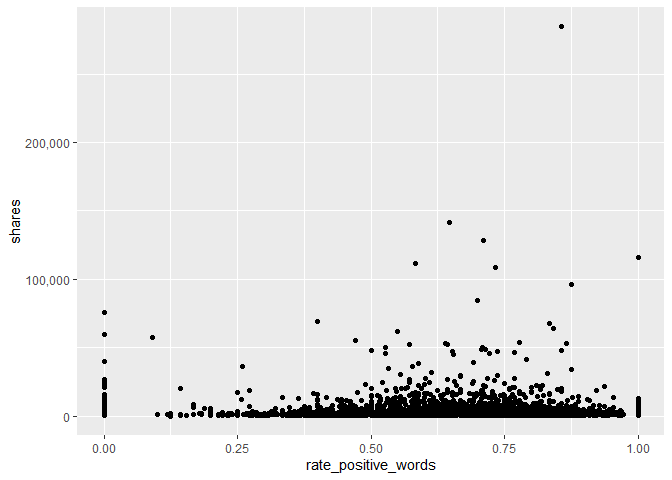

Channel Analysis
================
Maks Nikiforov and Mark Austin
Due 10/31/2021

-   [Introduction](#introduction)
-   [Data](#data)
-   [Summarizations](#summarizations)
-   [Modeling](#modeling)
-   [Model Comparisions](#model-comparisions)

**Analysis for the World Channel**

## Introduction

## Data

``` r
fullData<-read_csv("./data/OnlineNewsPopularity.csv")
```

Using data\_channel\_is\_world

``` r
params$channel
```

    ## [1] "data_channel_is_world"

``` r
channelData<-fullData %>% filter(eval(as.name(params$channel))==1) 

##test code to confirm by str the filter is as expected
str(channelData)
```

    ## spec_tbl_df [8,427 x 61] (S3: spec_tbl_df/tbl_df/tbl/data.frame)
    ##  $ url                          : chr [1:8427] "http://mashable.com/2013/01/07/chuck-hagel-website/" "http://mashable.com/2013/01/07/cosmic-events-doomsday/" "http://mashable.com/2013/01/07/earth-size-planets-milky-way/" "http://mashable.com/2013/01/07/ftc-google-leaks/" ...
    ##  $ timedelta                    : num [1:8427] 731 731 731 731 731 731 731 731 731 730 ...
    ##  $ n_tokens_title               : num [1:8427] 10 9 12 9 11 11 11 11 9 12 ...
    ##  $ n_tokens_content             : num [1:8427] 231 1248 682 391 125 ...
    ##  $ n_unique_tokens              : num [1:8427] 0.636 0.49 0.46 0.51 0.675 ...
    ##  $ n_non_stop_words             : num [1:8427] 1 1 1 1 1 ...
    ##  $ n_non_stop_unique_tokens     : num [1:8427] 0.797 0.732 0.635 0.65 0.797 ...
    ##  $ num_hrefs                    : num [1:8427] 4 11 10 9 1 8 7 8 3 5 ...
    ##  $ num_self_hrefs               : num [1:8427] 1 0 0 2 1 6 6 0 1 2 ...
    ##  $ num_imgs                     : num [1:8427] 1 1 1 1 1 1 1 1 1 0 ...
    ##  $ num_videos                   : num [1:8427] 1 0 0 1 0 0 0 0 0 0 ...
    ##  $ average_token_length         : num [1:8427] 5.09 4.62 4.62 5.3 4.82 ...
    ##  $ num_keywords                 : num [1:8427] 5 8 6 7 6 6 5 7 6 6 ...
    ##  $ data_channel_is_lifestyle    : num [1:8427] 0 0 0 0 0 0 0 0 0 0 ...
    ##  $ data_channel_is_entertainment: num [1:8427] 0 0 0 0 0 0 0 0 0 0 ...
    ##  $ data_channel_is_bus          : num [1:8427] 0 0 0 0 0 0 0 0 0 0 ...
    ##  $ data_channel_is_socmed       : num [1:8427] 0 0 0 0 0 0 0 0 0 0 ...
    ##  $ data_channel_is_tech         : num [1:8427] 0 0 0 0 0 0 0 0 0 0 ...
    ##  $ data_channel_is_world        : num [1:8427] 1 1 1 1 1 1 1 1 1 1 ...
    ##  $ kw_min_min                   : num [1:8427] 0 0 0 0 0 0 0 0 0 217 ...
    ##  $ kw_max_min                   : num [1:8427] 0 0 0 0 0 0 0 0 0 504 ...
    ##  $ kw_avg_min                   : num [1:8427] 0 0 0 0 0 ...
    ##  $ kw_min_max                   : num [1:8427] 0 0 0 0 0 0 0 0 0 0 ...
    ##  $ kw_max_max                   : num [1:8427] 0 0 0 0 0 0 0 0 0 17100 ...
    ##  $ kw_avg_max                   : num [1:8427] 0 0 0 0 0 ...
    ##  $ kw_min_avg                   : num [1:8427] 0 0 0 0 0 0 0 0 0 0 ...
    ##  $ kw_max_avg                   : num [1:8427] 0 0 0 0 0 ...
    ##  $ kw_avg_avg                   : num [1:8427] 0 0 0 0 0 ...
    ##  $ self_reference_min_shares    : num [1:8427] 0 0 0 704 16100 101 638 0 0 3100 ...
    ##  $ self_reference_max_shares    : num [1:8427] 0 0 0 704 16100 2600 3300 0 0 3100 ...
    ##  $ self_reference_avg_sharess   : num [1:8427] 0 0 0 704 16100 ...
    ##  $ weekday_is_monday            : num [1:8427] 1 1 1 1 1 1 1 1 1 0 ...
    ##  $ weekday_is_tuesday           : num [1:8427] 0 0 0 0 0 0 0 0 0 1 ...
    ##  $ weekday_is_wednesday         : num [1:8427] 0 0 0 0 0 0 0 0 0 0 ...
    ##  $ weekday_is_thursday          : num [1:8427] 0 0 0 0 0 0 0 0 0 0 ...
    ##  $ weekday_is_friday            : num [1:8427] 0 0 0 0 0 0 0 0 0 0 ...
    ##  $ weekday_is_saturday          : num [1:8427] 0 0 0 0 0 0 0 0 0 0 ...
    ##  $ weekday_is_sunday            : num [1:8427] 0 0 0 0 0 0 0 0 0 0 ...
    ##  $ is_weekend                   : num [1:8427] 0 0 0 0 0 0 0 0 0 0 ...
    ##  $ LDA_00                       : num [1:8427] 0.04 0.025 0.0333 0.0288 0.0333 ...
    ##  $ LDA_01                       : num [1:8427] 0.04 0.2873 0.0333 0.0286 0.0333 ...
    ##  $ LDA_02                       : num [1:8427] 0.84 0.401 0.867 0.681 0.7 ...
    ##  $ LDA_03                       : num [1:8427] 0.04 0.2619 0.0333 0.0286 0.2 ...
    ##  $ LDA_04                       : num [1:8427] 0.04 0.025 0.0333 0.2334 0.0333 ...
    ##  $ global_subjectivity          : num [1:8427] 0.314 0.482 0.473 0.284 0.396 ...
    ##  $ global_sentiment_polarity    : num [1:8427] 0.0519 0.1024 0.0622 0.0333 0.2108 ...
    ##  $ global_rate_positive_words   : num [1:8427] 0.039 0.0385 0.0499 0.0179 0.048 ...
    ##  $ global_rate_negative_words   : num [1:8427] 0.0303 0.02083 0.03959 0.00512 0 ...
    ##  $ rate_positive_words          : num [1:8427] 0.562 0.649 0.557 0.778 1 ...
    ##  $ rate_negative_words          : num [1:8427] 0.438 0.351 0.443 0.222 0 ...
    ##  $ avg_positive_polarity        : num [1:8427] 0.298 0.404 0.343 0.15 0.281 ...
    ##  $ min_positive_polarity        : num [1:8427] 0.1 0.1 0.05 0.05 0.1 ...
    ##  $ max_positive_polarity        : num [1:8427] 0.5 1 0.6 0.35 0.6 0.7 0.8 1 0.5 1 ...
    ##  $ avg_negative_polarity        : num [1:8427] -0.238 -0.415 -0.22 -0.108 0 ...
    ##  $ min_negative_polarity        : num [1:8427] -0.5 -1 -0.6 -0.167 0 ...
    ##  $ max_negative_polarity        : num [1:8427] -0.1 -0.1 -0.05 -0.05 0 -0.05 -0.125 -0.1 -0.2 -0.1 ...
    ##  $ title_subjectivity           : num [1:8427] 0 0 0.75 0 0.45 ...
    ##  $ title_sentiment_polarity     : num [1:8427] 0 0 -0.25 0 0.4 ...
    ##  $ abs_title_subjectivity       : num [1:8427] 0.5 0.5 0.25 0.5 0.05 ...
    ##  $ abs_title_sentiment_polarity : num [1:8427] 0 0 0.25 0 0.4 ...
    ##  $ shares                       : num [1:8427] 710 2200 1600 598 1500 504 1800 1200 495 755 ...
    ##  - attr(*, "spec")=
    ##   .. cols(
    ##   ..   url = col_character(),
    ##   ..   timedelta = col_double(),
    ##   ..   n_tokens_title = col_double(),
    ##   ..   n_tokens_content = col_double(),
    ##   ..   n_unique_tokens = col_double(),
    ##   ..   n_non_stop_words = col_double(),
    ##   ..   n_non_stop_unique_tokens = col_double(),
    ##   ..   num_hrefs = col_double(),
    ##   ..   num_self_hrefs = col_double(),
    ##   ..   num_imgs = col_double(),
    ##   ..   num_videos = col_double(),
    ##   ..   average_token_length = col_double(),
    ##   ..   num_keywords = col_double(),
    ##   ..   data_channel_is_lifestyle = col_double(),
    ##   ..   data_channel_is_entertainment = col_double(),
    ##   ..   data_channel_is_bus = col_double(),
    ##   ..   data_channel_is_socmed = col_double(),
    ##   ..   data_channel_is_tech = col_double(),
    ##   ..   data_channel_is_world = col_double(),
    ##   ..   kw_min_min = col_double(),
    ##   ..   kw_max_min = col_double(),
    ##   ..   kw_avg_min = col_double(),
    ##   ..   kw_min_max = col_double(),
    ##   ..   kw_max_max = col_double(),
    ##   ..   kw_avg_max = col_double(),
    ##   ..   kw_min_avg = col_double(),
    ##   ..   kw_max_avg = col_double(),
    ##   ..   kw_avg_avg = col_double(),
    ##   ..   self_reference_min_shares = col_double(),
    ##   ..   self_reference_max_shares = col_double(),
    ##   ..   self_reference_avg_sharess = col_double(),
    ##   ..   weekday_is_monday = col_double(),
    ##   ..   weekday_is_tuesday = col_double(),
    ##   ..   weekday_is_wednesday = col_double(),
    ##   ..   weekday_is_thursday = col_double(),
    ##   ..   weekday_is_friday = col_double(),
    ##   ..   weekday_is_saturday = col_double(),
    ##   ..   weekday_is_sunday = col_double(),
    ##   ..   is_weekend = col_double(),
    ##   ..   LDA_00 = col_double(),
    ##   ..   LDA_01 = col_double(),
    ##   ..   LDA_02 = col_double(),
    ##   ..   LDA_03 = col_double(),
    ##   ..   LDA_04 = col_double(),
    ##   ..   global_subjectivity = col_double(),
    ##   ..   global_sentiment_polarity = col_double(),
    ##   ..   global_rate_positive_words = col_double(),
    ##   ..   global_rate_negative_words = col_double(),
    ##   ..   rate_positive_words = col_double(),
    ##   ..   rate_negative_words = col_double(),
    ##   ..   avg_positive_polarity = col_double(),
    ##   ..   min_positive_polarity = col_double(),
    ##   ..   max_positive_polarity = col_double(),
    ##   ..   avg_negative_polarity = col_double(),
    ##   ..   min_negative_polarity = col_double(),
    ##   ..   max_negative_polarity = col_double(),
    ##   ..   title_subjectivity = col_double(),
    ##   ..   title_sentiment_polarity = col_double(),
    ##   ..   abs_title_subjectivity = col_double(),
    ##   ..   abs_title_sentiment_polarity = col_double(),
    ##   ..   shares = col_double()
    ##   .. )
    ##  - attr(*, "problems")=<externalptr>

``` r
###Need to drop other channel variables??
```

## Summarizations

``` r
##For now this is just a test graph to test out automation
g<-ggplot(data = channelData,
          aes(x=rate_positive_words,y=self_reference_avg_sharess))
g + geom_point()
```

<!-- -->

## Modeling

``` r
#Using set.seed per suggestion so that work will be reproducible
```

## Model Comparisions
